```python
# This Python 3 environment comes with many helpful analytics libraries installed
# It is defined by the kaggle/python Docker image: https://github.com/kaggle/docker-python
# For example, here's several helpful packages to load

import numpy as np # linear algebra
import pandas as pd # data processing, CSV file I/O (e.g. pd.read_csv)

# Input data files are available in the read-only "../input/" directory
# For example, running this (by clicking run or pressing Shift+Enter) will list all files under the input directory

import os
for dirname, _, filenames in os.walk('/kaggle/input'):
    for filename in filenames:
        print(os.path.join(dirname, filename))

# You can write up to 20GB to the current directory (/kaggle/working/) that gets preserved as output when you create a version using "Save & Run All" 
# You can also write temporary files to /kaggle/temp/, but they won't be saved outside of the current session
```

    /kaggle/input/2017-yellow-taxi-trip-data-csv/2017_Yellow_Taxi_Trip_Data (1).csv


```python
# 📌 Visualization Packages
import matplotlib.pyplot as plt
import seaborn as sns

# 📌 Date Conversions for Calculating Trip Durations
from datetime import datetime, date, timedelta

# 📌 Scikit-Learn Packages for Machine Learning
from sklearn.preprocessing import StandardScaler
from sklearn.model_selection import train_test_split, GridSearchCV , RandomizedSearchCV
from sklearn.metrics import (
    accuracy_score, precision_score, recall_score, f1_score, confusion_matrix,
    ConfusionMatrixDisplay, roc_auc_score, roc_curve, RocCurveDisplay,
    mean_absolute_error, mean_squared_error, r2_score
)
from sklearn.linear_model import LinearRegression
from sklearn.ensemble import RandomForestClassifier

# 📌 XGBoost Packages
from xgboost import XGBClassifier, plot_importance
```


```python
df = pd.read_csv("/kaggle/input/2017-yellow-taxi-trip-data-csv/2017_Yellow_Taxi_Trip_Data (1).csv")
```


```python
import warnings
warnings.simplefilter(action='ignore', category=FutureWarning)
```

# Senaryo 
## Şirketi tanıyalım 
Automatidata works with its clients to transform their unused and stored data into useful solutions, such as performance dashboards, customer-facing tools, strategic business insights, and more. They specialize in identifying a client’s business needs and utilizing their data to meet those business needs. 

Automatidata is consulting for the New York City Taxi and Limousine Commission (TLC). New York City TLC is an agency responsible for licensing and regulating New York City's taxi cabs and for-hire vehicles. The agency has partnered with Automatidata to develop a regression model that helps estimate taxi fares before the ride, based on data that TLC has gathered. 

The TLC data comes from over 200,000 taxi and limousine licensees, making approximately one million combined trips per day. 

Note: This project's dataset was created for pedagogical purposes and may not be indicative of New York City taxi cab riders' behavior.
## Görev 1 : EDA
Luana Rodriquez, the senior data analyst at Automatidata, is pleased with the work you have already completed and requests your assistance with some EDA and data visualization work for the New York City Taxi and Limousine Commission project (New York City TLC) to get a general understanding of what taxi ridership looks like. The management team is asking for a Python notebook showing data structuring and cleaning, as well as any matplotlib/seaborn visualizations plotted to help understand the data. At the very least, include a box plot of the ride durations and some time series plots, like a breakdown by quarter or month.

Additionally, the management team has recently asked all EDA to include Tableau visualizations. For this taxi data, create a Tableau dashboard showing a New York City map of taxi/limo trips by month. Make sure it is easy to understand to someone who isn’t data savvy, and remember that the assistant director at the New York City TLC is a person with visual impairments

The purpose of this project is to conduct exploratory data analysis on a provided data set. Your mission is to continue the investigation you began in C2 and perform further EDA on this data with the aim of learning more about the variables.

The goal is to clean data set and create a visualization.

This activity has 4 parts:

Part 1: Imports, links, and loading

Part 2: Data Exploration

Data cleaning
Part 3: Building visualizations

Part 4: Evaluate and share results

## Görev 2 : Analyze the relationship between fare amount and payment type.
You receive a new email from Uli King, Automatidata’s project manager. Uli tells your team about a new request from the New York City TLC: **to analyze the relationship between fare amount and payment type.** You also discover follow-up emails from three other team members: Deshawn Washington, Luana Rodriguez, and Udo Bankole. These emails discuss the details of the analysis. A final email from Luana includes your specific assignment: to conduct an A/B test.

The purpose of this project is to demostrate knowledge of how to prepare, create, and analyze A/B tests. Your A/B test results should aim to find ways to generate more revenue for taxi cab drivers.

Note: For the purpose of this exercise, assume that the sample data comes from an experiment in which customers are randomly selected and divided into two groups: 1) customers who are required to pay with credit card, 2) customers who are required to pay with cash. Without this assumption, we cannot draw causal conclusions about how payment method affects fare amount.

The goal is to apply descriptive statistics and hypothesis testing in Python. The goal for this A/B test is to sample data and analyze whether there is a relationship between payment type and fare amount. For example: discover if customers who use credit cards pay higher fare amounts than customers who use cash.

## Görev 3 : Regression Analysis 
The Automatidata team has reviewed the results of the A/B testing. Now it’s time to work on predicting the taxi fare amounts. You’ve impressed your Automatidata colleagues with your hard work and attention to detail. The data team believes that you are ready to build the regression model and update the client New York City TLC about your progress.

The purpose of this project is to demostrate knowledge of EDA and a multiple linear regression model

The goal is to build a multiple linear regression model and evaluate the model
This activity has three parts:

Part 1: EDA & Checking Model Assumptions

What are some purposes of EDA before constructing a multiple linear regression model?
Part 2: Model Building and evaluation

What resources do you find yourself using as you complete this stage?
Part 3: Interpreting Model Results

What key insights emerged from your model(s)?

What business recommendations do you propose based on the models built?

## Görev 4: Modelling
 (New York City TLC), was impressed with the work you have done and has requested that you build a machine learning model to predict if a customer will not leave a tip. They want to use the model in an app that will alert taxi drivers to customers who are unlikely to tip, since drivers depend on tips.
 
 The purpose of this model is to find ways to generate more revenue for taxi cab drivers.

The goal of this model is to predict whether or not a customer is a generous tipper.


This activity has three parts:

Part 1: Ethical considerations

Consider the ethical implications of the request

Should the objective of the model be adjusted?

Part 2: Feature engineering

Perform feature selection, extraction, and transformation to prepare the data for modeling
Part 3: Modeling

Build the models, evaluate them, and advise on next steps
Follow the instructions and answer the questions below to complete the activity. Then, complete an Executive Summary using the questions listed on the PACE Strategy Document.

| Sütun Adı             | Açıklama                                                                                                                                                                                                                 |
|-----------------------|---------------------------------------------------------------------------------------------------------------------------------------------------------------------------------------------------------------------------|
| ID                    | Yolculuk tanımlama numarası                                                                                                                                                                                              |
| VendorID              | Kaydı sağlayan TPEP sağlayıcısını belirten bir kod. 1= Creative Mobile Technologies, LLC; 2= VeriFone Inc.                                                                         |
| tpep_pickup_datetime  | Taksi metre açıldığında kaydedilen tarih ve saat.                                                                                                                                                                        |
| tpep_dropoff_datetime | Taksi metre kapandığında kaydedilen tarih ve saat.                                                                                                                                                                       |
| Passenger_count       | Araçtaki yolcu sayısı. Bu değer, şoför tarafından girilir.                                                                                                                                                               |
| Trip_distance         | Taksi metre tarafından bildirilen, yolculuk boyunca kat edilen mesafe (mil cinsinden).                                                                                                                                   |
| PULocationID          | Taksi metrenin açıldığı TLC Taksi Bölgesi.                                                                                                                                                                                |
| DOLocationID          | Taksi metrenin kapandığı TLC Taksi Bölgesi.                                                                                                                                                                               |
| RateCodeID            | Yolculuğun sonunda geçerli olan ücret kodu. 1= Standart ücret; 2=JFK; 3=Newark; 4=Nassau veya Westchester; 5=Anlaşmalı ücret; 6=Grup yolculuğu.                                    |
| Store_and_fwd_flag    | Bu bayrak, yolculuk kaydının araç hafızasında tutulup tutulmadığını belirtir. Y= araç hafızasında tutulmuş; N= araç hafızasında tutulmamış.                                        |
| Payment_type          | Yolcunun yolculuk için nasıl ödeme yaptığını belirten bir kod. 1= Kredi kartı; 2= Nakit; 3= Ücretsiz; 4= İtiraz; 5= Bilinmiyor; 6= İptal edilmiş yolculuk.                         |
| Fare_amount           | Taksi metre tarafından hesaplanan zaman ve mesafe ücreti.                                                                                                                                                                |
| Extra                 | Çeşitli ek ücretler ve ek masraflar. Şu anda sadece $0.50 ve $1 yoğun saat ve gece ek ücretlerini içerir.                                                                                                                |
| MTA_tax               | Kullanılan taksimetre ücretine bağlı olarak otomatik olarak tetiklenen $0.50 MTA vergisi.                                                                                                                                |
| Improvement_surcharge | Bayrak düşümünde uygulanan $0.30 iyileştirme ücreti. Bu iyileştirme ücreti 2015 yılında uygulanmaya başlandı.                                                                                                             |
| Tip_amount            | Bahşiş miktarı – Bu alan, kredi kartı bahşişleri için otomatik olarak doldurulur. Nakit bahşişler dahil değildir.                                                                                                        |
| Tolls_amount          | Yolculuk sırasında ödenen toplam geçiş ücreti miktarı.                                                                                                                                                                   |
| Total_amount          | Yolculardan alınan toplam ücret. Nakit bahşişleri içermez.                                                                                                                                                               |

# Görev 1  
Amacımız veri seti hakkında bilgi sahibi olmak. Bunu yaparken Descriptive statistic kullanmak ve görselleştirmeler ile veriye hakim olmak. 

## Descriptive Statistic


```python
df.head()
```


<div>
<style scoped>
    .dataframe tbody tr th:only-of-type {
        vertical-align: middle;
    }

    .dataframe tbody tr th {
        vertical-align: top;
    }

    .dataframe thead th {
        text-align: right;
    }
</style>
<table border="1" class="dataframe">
  <thead>
    <tr style="text-align: right;">
      <th></th>
      <th>Unnamed: 0</th>
      <th>VendorID</th>
      <th>tpep_pickup_datetime</th>
      <th>tpep_dropoff_datetime</th>
      <th>passenger_count</th>
      <th>trip_distance</th>
      <th>RatecodeID</th>
      <th>store_and_fwd_flag</th>
      <th>PULocationID</th>
      <th>DOLocationID</th>
      <th>payment_type</th>
      <th>fare_amount</th>
      <th>extra</th>
      <th>mta_tax</th>
      <th>tip_amount</th>
      <th>tolls_amount</th>
      <th>improvement_surcharge</th>
      <th>total_amount</th>
    </tr>
  </thead>
  <tbody>
    <tr>
      <th>0</th>
      <td>24870114</td>
      <td>2</td>
      <td>03/25/2017 8:55:43 AM</td>
      <td>03/25/2017 9:09:47 AM</td>
      <td>6</td>
      <td>3.34</td>
      <td>1</td>
      <td>N</td>
      <td>100</td>
      <td>231</td>
      <td>1</td>
      <td>13.0</td>
      <td>0.0</td>
      <td>0.5</td>
      <td>2.76</td>
      <td>0.0</td>
      <td>0.3</td>
      <td>16.56</td>
    </tr>
    <tr>
      <th>1</th>
      <td>35634249</td>
      <td>1</td>
      <td>04/11/2017 2:53:28 PM</td>
      <td>04/11/2017 3:19:58 PM</td>
      <td>1</td>
      <td>1.80</td>
      <td>1</td>
      <td>N</td>
      <td>186</td>
      <td>43</td>
      <td>1</td>
      <td>16.0</td>
      <td>0.0</td>
      <td>0.5</td>
      <td>4.00</td>
      <td>0.0</td>
      <td>0.3</td>
      <td>20.80</td>
    </tr>
    <tr>
      <th>2</th>
      <td>106203690</td>
      <td>1</td>
      <td>12/15/2017 7:26:56 AM</td>
      <td>12/15/2017 7:34:08 AM</td>
      <td>1</td>
      <td>1.00</td>
      <td>1</td>
      <td>N</td>
      <td>262</td>
      <td>236</td>
      <td>1</td>
      <td>6.5</td>
      <td>0.0</td>
      <td>0.5</td>
      <td>1.45</td>
      <td>0.0</td>
      <td>0.3</td>
      <td>8.75</td>
    </tr>
    <tr>
      <th>3</th>
      <td>38942136</td>
      <td>2</td>
      <td>05/07/2017 1:17:59 PM</td>
      <td>05/07/2017 1:48:14 PM</td>
      <td>1</td>
      <td>3.70</td>
      <td>1</td>
      <td>N</td>
      <td>188</td>
      <td>97</td>
      <td>1</td>
      <td>20.5</td>
      <td>0.0</td>
      <td>0.5</td>
      <td>6.39</td>
      <td>0.0</td>
      <td>0.3</td>
      <td>27.69</td>
    </tr>
    <tr>
      <th>4</th>
      <td>30841670</td>
      <td>2</td>
      <td>04/15/2017 11:32:20 PM</td>
      <td>04/15/2017 11:49:03 PM</td>
      <td>1</td>
      <td>4.37</td>
      <td>1</td>
      <td>N</td>
      <td>4</td>
      <td>112</td>
      <td>2</td>
      <td>16.5</td>
      <td>0.5</td>
      <td>0.5</td>
      <td>0.00</td>
      <td>0.0</td>
      <td>0.3</td>
      <td>17.80</td>
    </tr>
  </tbody>
</table>
</div>


```python
df.size
```


    408582


```python
df.describe()
```


<div>
<style scoped>
    .dataframe tbody tr th:only-of-type {
        vertical-align: middle;
    }

    .dataframe tbody tr th {
        vertical-align: top;
    }

    .dataframe thead th {
        text-align: right;
    }
</style>
<table border="1" class="dataframe">
  <thead>
    <tr style="text-align: right;">
      <th></th>
      <th>Unnamed: 0</th>
      <th>VendorID</th>
      <th>passenger_count</th>
      <th>trip_distance</th>
      <th>RatecodeID</th>
      <th>PULocationID</th>
      <th>DOLocationID</th>
      <th>payment_type</th>
      <th>fare_amount</th>
      <th>extra</th>
      <th>mta_tax</th>
      <th>tip_amount</th>
      <th>tolls_amount</th>
      <th>improvement_surcharge</th>
      <th>total_amount</th>
    </tr>
  </thead>
  <tbody>
    <tr>
      <th>count</th>
      <td>2.269900e+04</td>
      <td>22699.000000</td>
      <td>22699.000000</td>
      <td>22699.000000</td>
      <td>22699.000000</td>
      <td>22699.000000</td>
      <td>22699.000000</td>
      <td>22699.000000</td>
      <td>22699.000000</td>
      <td>22699.000000</td>
      <td>22699.000000</td>
      <td>22699.000000</td>
      <td>22699.000000</td>
      <td>22699.000000</td>
      <td>22699.000000</td>
    </tr>
    <tr>
      <th>mean</th>
      <td>5.675849e+07</td>
      <td>1.556236</td>
      <td>1.642319</td>
      <td>2.913313</td>
      <td>1.043394</td>
      <td>162.412353</td>
      <td>161.527997</td>
      <td>1.336887</td>
      <td>13.026629</td>
      <td>0.333275</td>
      <td>0.497445</td>
      <td>1.835781</td>
      <td>0.312542</td>
      <td>0.299551</td>
      <td>16.310502</td>
    </tr>
    <tr>
      <th>std</th>
      <td>3.274493e+07</td>
      <td>0.496838</td>
      <td>1.285231</td>
      <td>3.653171</td>
      <td>0.708391</td>
      <td>66.633373</td>
      <td>70.139691</td>
      <td>0.496211</td>
      <td>13.243791</td>
      <td>0.463097</td>
      <td>0.039465</td>
      <td>2.800626</td>
      <td>1.399212</td>
      <td>0.015673</td>
      <td>16.097295</td>
    </tr>
    <tr>
      <th>min</th>
      <td>1.212700e+04</td>
      <td>1.000000</td>
      <td>0.000000</td>
      <td>0.000000</td>
      <td>1.000000</td>
      <td>1.000000</td>
      <td>1.000000</td>
      <td>1.000000</td>
      <td>-120.000000</td>
      <td>-1.000000</td>
      <td>-0.500000</td>
      <td>0.000000</td>
      <td>0.000000</td>
      <td>-0.300000</td>
      <td>-120.300000</td>
    </tr>
    <tr>
      <th>25%</th>
      <td>2.852056e+07</td>
      <td>1.000000</td>
      <td>1.000000</td>
      <td>0.990000</td>
      <td>1.000000</td>
      <td>114.000000</td>
      <td>112.000000</td>
      <td>1.000000</td>
      <td>6.500000</td>
      <td>0.000000</td>
      <td>0.500000</td>
      <td>0.000000</td>
      <td>0.000000</td>
      <td>0.300000</td>
      <td>8.750000</td>
    </tr>
    <tr>
      <th>50%</th>
      <td>5.673150e+07</td>
      <td>2.000000</td>
      <td>1.000000</td>
      <td>1.610000</td>
      <td>1.000000</td>
      <td>162.000000</td>
      <td>162.000000</td>
      <td>1.000000</td>
      <td>9.500000</td>
      <td>0.000000</td>
      <td>0.500000</td>
      <td>1.350000</td>
      <td>0.000000</td>
      <td>0.300000</td>
      <td>11.800000</td>
    </tr>
    <tr>
      <th>75%</th>
      <td>8.537452e+07</td>
      <td>2.000000</td>
      <td>2.000000</td>
      <td>3.060000</td>
      <td>1.000000</td>
      <td>233.000000</td>
      <td>233.000000</td>
      <td>2.000000</td>
      <td>14.500000</td>
      <td>0.500000</td>
      <td>0.500000</td>
      <td>2.450000</td>
      <td>0.000000</td>
      <td>0.300000</td>
      <td>17.800000</td>
    </tr>
    <tr>
      <th>max</th>
      <td>1.134863e+08</td>
      <td>2.000000</td>
      <td>6.000000</td>
      <td>33.960000</td>
      <td>99.000000</td>
      <td>265.000000</td>
      <td>265.000000</td>
      <td>4.000000</td>
      <td>999.990000</td>
      <td>4.500000</td>
      <td>0.500000</td>
      <td>200.000000</td>
      <td>19.100000</td>
      <td>0.300000</td>
      <td>1200.290000</td>
    </tr>
  </tbody>
</table>
</div>


Fare_amount, total_amount : negatif veriler var burada bir hata olmuş olmalı. 1000 dolar gibi uçuk sayılar da var bunlar kesinlikle outliers. 

extra, mta_tax,improvement_surcharge	: Burada da negatif veriler var

tip_amount: 200 dolar çok yüksek burada bir outliers var 


```python
df.info()
```

    <class 'pandas.core.frame.DataFrame'>
    RangeIndex: 22699 entries, 0 to 22698
    Data columns (total 18 columns):
     #   Column                 Non-Null Count  Dtype  
    ---  ------                 --------------  -----  
     0   Unnamed: 0             22699 non-null  int64  
     1   VendorID               22699 non-null  int64  
     2   tpep_pickup_datetime   22699 non-null  object 
     3   tpep_dropoff_datetime  22699 non-null  object 
     4   passenger_count        22699 non-null  int64  
     5   trip_distance          22699 non-null  float64
     6   RatecodeID             22699 non-null  int64  
     7   store_and_fwd_flag     22699 non-null  object 
     8   PULocationID           22699 non-null  int64  
     9   DOLocationID           22699 non-null  int64  
     10  payment_type           22699 non-null  int64  
     11  fare_amount            22699 non-null  float64
     12  extra                  22699 non-null  float64
     13  mta_tax                22699 non-null  float64
     14  tip_amount             22699 non-null  float64
     15  tolls_amount           22699 non-null  float64
     16  improvement_surcharge  22699 non-null  float64
     17  total_amount           22699 non-null  float64
    dtypes: float64(8), int64(7), object(3)
    memory usage: 3.1+ MB


```python
df.isnull().sum()
```


    Unnamed: 0               0
    VendorID                 0
    tpep_pickup_datetime     0
    tpep_dropoff_datetime    0
    passenger_count          0
    trip_distance            0
    RatecodeID               0
    store_and_fwd_flag       0
    PULocationID             0
    DOLocationID             0
    payment_type             0
    fare_amount              0
    extra                    0
    mta_tax                  0
    tip_amount               0
    tolls_amount             0
    improvement_surcharge    0
    total_amount             0
    dtype: int64


Buradan anlaşılacağı üzere boş sütun yok


```python


df.replace([np.inf, -np.inf], np.nan, inplace=True)  # Sonsuz değerleri NaN ile değiştir
df.dropna(inplace=True)  # NaN olan satırları kaldır
```


```python
# çoğaltılmış değerleri düşürelim 
print('Shape of dataframe with duplicates dropped:', df.drop_duplicates().shape)
```

    Shape of dataframe with duplicates dropped: (22699, 18)


Kopyalanmış veri yokmuş


```python
# Kullanılacak sütunları tanımla
columns = ["fare_amount", "total_amount", "extra", "mta_tax", "improvement_surcharge"]

# Tüm belirtilen sütunlardaki negatif değerleri sıfıra ayarla
df[columns] = df[columns].clip(lower=0)

# Her sütun için minimum değeri yazdır
min_values = df[columns].min()
print("Minimum Değerler:\n", min_values)
```

    Minimum Değerler:
     fare_amount              0.0
    total_amount             0.0
    extra                    0.0
    mta_tax                  0.0
    improvement_surcharge    0.0
    dtype: float64


```python
# tpep_dropoff_datetime gibi değişkenleri zamana çevirelim 
# Check the format of the data
df['tpep_dropoff_datetime'][0]

# Display data types of `tpep_pickup_datetime`, `tpep_dropoff_datetime`
print('Data type of tpep_pickup_datetime:', df['tpep_pickup_datetime'].dtype)
print('Data type of tpep_dropoff_datetime:', df['tpep_dropoff_datetime'].dtype)

# Convert `tpep_pickup_datetime` to datetime format
df['tpep_pickup_datetime'] = pd.to_datetime(df['tpep_pickup_datetime'], format='%m/%d/%Y %I:%M:%S %p')

# Convert `tpep_dropoff_datetime` to datetime format
df['tpep_dropoff_datetime'] = pd.to_datetime(df['tpep_dropoff_datetime'], format='%m/%d/%Y %I:%M:%S %p')

# Display data types of `tpep_pickup_datetime`, `tpep_dropoff_datetime`
print('Data type of tpep_pickup_datetime:', df['tpep_pickup_datetime'].dtype)
print('Data type of tpep_dropoff_datetime:', df['tpep_dropoff_datetime'].dtype)

df.head(3)
```

    Data type of tpep_pickup_datetime: object
    Data type of tpep_dropoff_datetime: object
    Data type of tpep_pickup_datetime: datetime64[ns]
    Data type of tpep_dropoff_datetime: datetime64[ns]


<div>
<style scoped>
    .dataframe tbody tr th:only-of-type {
        vertical-align: middle;
    }

    .dataframe tbody tr th {
        vertical-align: top;
    }

    .dataframe thead th {
        text-align: right;
    }
</style>
<table border="1" class="dataframe">
  <thead>
    <tr style="text-align: right;">
      <th></th>
      <th>Unnamed: 0</th>
      <th>VendorID</th>
      <th>tpep_pickup_datetime</th>
      <th>tpep_dropoff_datetime</th>
      <th>passenger_count</th>
      <th>trip_distance</th>
      <th>RatecodeID</th>
      <th>store_and_fwd_flag</th>
      <th>PULocationID</th>
      <th>DOLocationID</th>
      <th>payment_type</th>
      <th>fare_amount</th>
      <th>extra</th>
      <th>mta_tax</th>
      <th>tip_amount</th>
      <th>tolls_amount</th>
      <th>improvement_surcharge</th>
      <th>total_amount</th>
    </tr>
  </thead>
  <tbody>
    <tr>
      <th>0</th>
      <td>24870114</td>
      <td>2</td>
      <td>2017-03-25 08:55:43</td>
      <td>2017-03-25 09:09:47</td>
      <td>6</td>
      <td>3.34</td>
      <td>1</td>
      <td>N</td>
      <td>100</td>
      <td>231</td>
      <td>1</td>
      <td>13.0</td>
      <td>0.0</td>
      <td>0.5</td>
      <td>2.76</td>
      <td>0.0</td>
      <td>0.3</td>
      <td>16.56</td>
    </tr>
    <tr>
      <th>1</th>
      <td>35634249</td>
      <td>1</td>
      <td>2017-04-11 14:53:28</td>
      <td>2017-04-11 15:19:58</td>
      <td>1</td>
      <td>1.80</td>
      <td>1</td>
      <td>N</td>
      <td>186</td>
      <td>43</td>
      <td>1</td>
      <td>16.0</td>
      <td>0.0</td>
      <td>0.5</td>
      <td>4.00</td>
      <td>0.0</td>
      <td>0.3</td>
      <td>20.80</td>
    </tr>
    <tr>
      <th>2</th>
      <td>106203690</td>
      <td>1</td>
      <td>2017-12-15 07:26:56</td>
      <td>2017-12-15 07:34:08</td>
      <td>1</td>
      <td>1.00</td>
      <td>1</td>
      <td>N</td>
      <td>262</td>
      <td>236</td>
      <td>1</td>
      <td>6.5</td>
      <td>0.0</td>
      <td>0.5</td>
      <td>1.45</td>
      <td>0.0</td>
      <td>0.3</td>
      <td>8.75</td>
    </tr>
  </tbody>
</table>
</div>


## Visualisation  

### trip_distance


```python
# Create box plot of trip_distance
plt.figure(figsize=(10,2))
plt.title('trip_distance')

sns.boxplot(data=None, x=df['trip_distance'], fliersize=2);
```


    
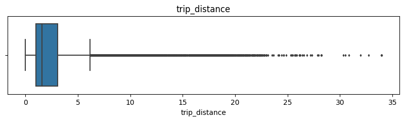
    


```python
# Q1 ve Q3 hesapla
Q1 = df['trip_distance'].quantile(0.25)  # 1. Çeyrek (25. yüzdelik)
Q3 = df['trip_distance'].quantile(0.75)  # 3. Çeyrek (75. yüzdelik)

# IQR hesapla
IQR = Q3 - Q1

# Alt ve üst sınırları belirle
lower_bound = Q1 - 1.5 * IQR
upper_bound = Q3 + 1.5 * IQR

# Aykırı değerleri filtrele
outliers = df[(df['trip_distance'] < lower_bound) | (df['trip_distance'] > upper_bound)]

# Sonuçları yazdır
print(f"Q1: {Q1}, Q3: {Q3}, IQR: {IQR}")
print(f"Aykırı değer sayısı: {outliers.shape[0]}")
```

    Q1: 0.99, Q3: 3.06, IQR: 2.0700000000000003
    Aykırı değer sayısı: 2527


```python
# Create histogram of trip_distance
plt.figure(figsize=(10,5))
sns.histplot(df['trip_distance'], bins=range(0,26,1))
plt.title('Trip distance histogram');
```


    
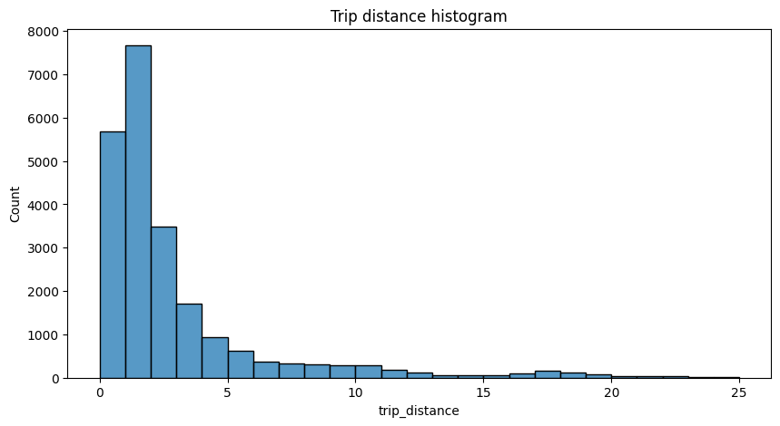
    


### total_amount


```python
# Create box plot of total_amount
plt.figure(figsize=(20,2))
plt.title('total_amount')
sns.boxplot(x=df['total_amount'], fliersize=1);
```


    
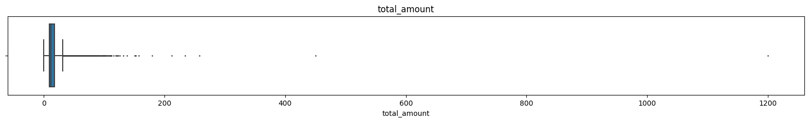
    


```python
# Create histogram of total_amount
plt.figure(figsize=(12,6))
ax = sns.histplot(df['total_amount'], bins=range(-10,101,5))
ax.set_xticks(range(-10,101,5))
ax.set_xticklabels(range(-10,101,5))
plt.title('Total amount histogram');
```


    
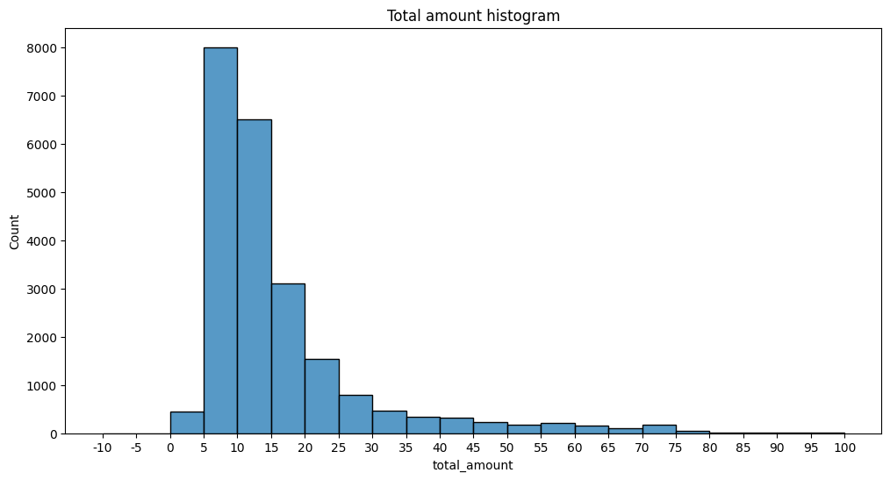
    


Harcama dağılımları genellikle 5 - 30 dolar arasında oluyor 100 dolar üzerindeki sayılar çok ekstrem kalıyor.

- Bu sayıların sebebi veri tabanındaki bir hata olabilir.
- içerik üreticileri taksi ile bir şehirden diğer şehre gitmeyi seçebilir.
Fakat bukadar uç değerler bizim araştırmamızı ve modelimizi kötü etkileyebilir bu değerleri sonrasında düzenleyeceğiz

### Tip amount 


```python
# Create box plot of tip_amount
plt.figure(figsize=(10,2))
plt.title('tip_amount')
sns.boxplot(x=df['tip_amount'], fliersize=1);
```


    
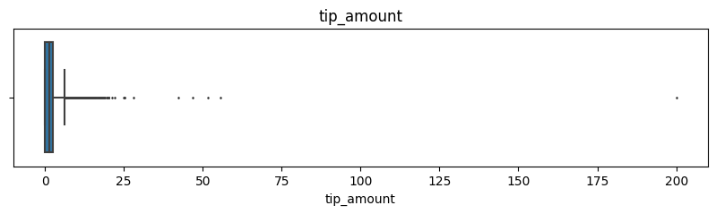
    


```python
# Create histogram of tip_amount
plt.figure(figsize=(12,6))
ax = sns.histplot(df['tip_amount'], bins=range(0,21,1))
ax.set_xticks(range(0,21,1))
ax.set_xticklabels(range(0,21,1))
plt.title('Tip amount histogram');
plt.show()
```


    
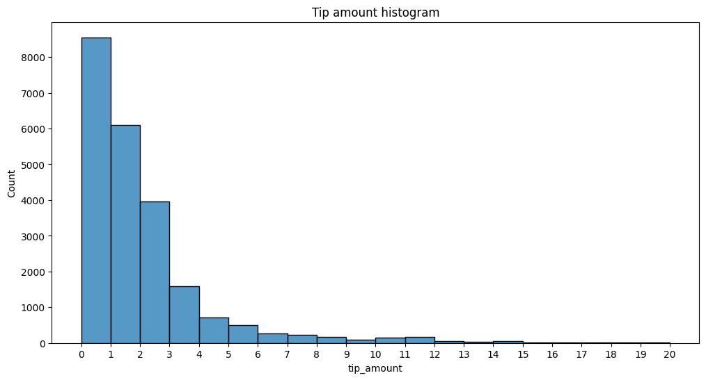
    


Genellikle tiplerin %75 lik dilimi 2 dolar civarında bunu describe metodu ile görebilmiştik. Yaklaşık 5 dolara kadar verilen bahşişler %99 oluşturuyor .
Grafiklerden görülebileceği üzere bahşişler 0 ile 5 arasında yığılıyor özellikle 1-3 arasında

### tip_amount by vendor


```python
# Create histogram of tip_amount by vendor
plt.figure(figsize=(12,7))
ax = sns.histplot(data=df, x='tip_amount', bins=range(0,21,1), 
                  hue='VendorID', 
                  multiple='stack',
                  palette='pastel')
ax.set_xticks(range(0,21,1))
ax.set_xticklabels(range(0,21,1))
plt.title('Tip amount by vendor histogram');
```


    
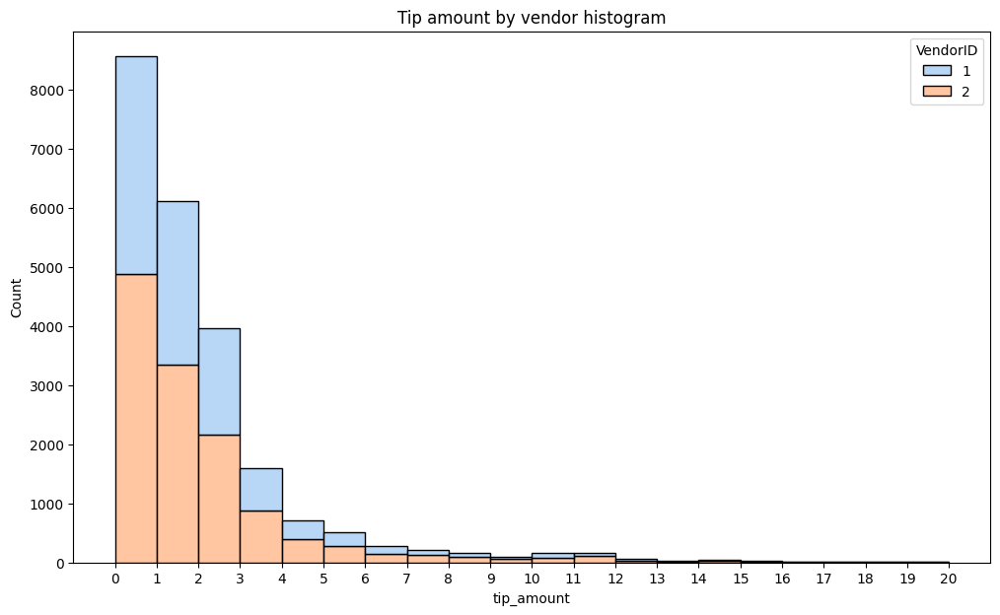
    


### Mean tips by passenger count


```python
df['passenger_count'].value_counts()
```


    passenger_count
    1    16117
    2     3305
    5     1143
    3      953
    6      693
    4      455
    0       33
    Name: count, dtype: int64


Çoğunlukla 1 veya 2 kişi biniliyor.
0 kişinin binmesi mantıklı değil bu satır düşürülecek 


```python
df.info()
```

    <class 'pandas.core.frame.DataFrame'>
    RangeIndex: 22699 entries, 0 to 22698
    Data columns (total 18 columns):
     #   Column                 Non-Null Count  Dtype         
    ---  ------                 --------------  -----         
     0   Unnamed: 0             22699 non-null  int64         
     1   VendorID               22699 non-null  int64         
     2   tpep_pickup_datetime   22699 non-null  datetime64[ns]
     3   tpep_dropoff_datetime  22699 non-null  datetime64[ns]
     4   passenger_count        22699 non-null  int64         
     5   trip_distance          22699 non-null  float64       
     6   RatecodeID             22699 non-null  int64         
     7   store_and_fwd_flag     22699 non-null  object        
     8   PULocationID           22699 non-null  int64         
     9   DOLocationID           22699 non-null  int64         
     10  payment_type           22699 non-null  int64         
     11  fare_amount            22699 non-null  float64       
     12  extra                  22699 non-null  float64       
     13  mta_tax                22699 non-null  float64       
     14  tip_amount             22699 non-null  float64       
     15  tolls_amount           22699 non-null  float64       
     16  improvement_surcharge  22699 non-null  float64       
     17  total_amount           22699 non-null  float64       
    dtypes: datetime64[ns](2), float64(8), int64(7), object(1)
    memory usage: 3.1+ MB


```python
df['passenger_count'].value_counts()
```


    passenger_count
    1    16117
    2     3305
    5     1143
    3      953
    6      693
    4      455
    0       33
    Name: count, dtype: int64


```python
df[df['passenger_count'] == 0 ]
```


<div>
<style scoped>
    .dataframe tbody tr th:only-of-type {
        vertical-align: middle;
    }

    .dataframe tbody tr th {
        vertical-align: top;
    }

    .dataframe thead th {
        text-align: right;
    }
</style>
<table border="1" class="dataframe">
  <thead>
    <tr style="text-align: right;">
      <th></th>
      <th>Unnamed: 0</th>
      <th>VendorID</th>
      <th>tpep_pickup_datetime</th>
      <th>tpep_dropoff_datetime</th>
      <th>passenger_count</th>
      <th>trip_distance</th>
      <th>RatecodeID</th>
      <th>store_and_fwd_flag</th>
      <th>PULocationID</th>
      <th>DOLocationID</th>
      <th>payment_type</th>
      <th>fare_amount</th>
      <th>extra</th>
      <th>mta_tax</th>
      <th>tip_amount</th>
      <th>tolls_amount</th>
      <th>improvement_surcharge</th>
      <th>total_amount</th>
    </tr>
  </thead>
  <tbody>
    <tr>
      <th>1516</th>
      <td>96563556</td>
      <td>1</td>
      <td>2017-11-14 15:45:23</td>
      <td>2017-11-14 16:26:38</td>
      <td>0</td>
      <td>8.8</td>
      <td>1</td>
      <td>N</td>
      <td>138</td>
      <td>164</td>
      <td>1</td>
      <td>33.0</td>
      <td>0.0</td>
      <td>0.5</td>
      <td>5.55</td>
      <td>5.76</td>
      <td>0.3</td>
      <td>45.11</td>
    </tr>
    <tr>
      <th>1874</th>
      <td>102273749</td>
      <td>1</td>
      <td>2017-12-03 12:05:52</td>
      <td>2017-12-03 12:13:51</td>
      <td>0</td>
      <td>1.1</td>
      <td>1</td>
      <td>N</td>
      <td>48</td>
      <td>237</td>
      <td>2</td>
      <td>7.0</td>
      <td>0.0</td>
      <td>0.5</td>
      <td>0.00</td>
      <td>0.00</td>
      <td>0.3</td>
      <td>7.80</td>
    </tr>
    <tr>
      <th>1925</th>
      <td>75654951</td>
      <td>1</td>
      <td>2017-09-09 03:44:45</td>
      <td>2017-09-09 03:49:19</td>
      <td>0</td>
      <td>0.8</td>
      <td>1</td>
      <td>N</td>
      <td>48</td>
      <td>48</td>
      <td>2</td>
      <td>5.0</td>
      <td>0.5</td>
      <td>0.5</td>
      <td>0.00</td>
      <td>0.00</td>
      <td>0.3</td>
      <td>6.30</td>
    </tr>
    <tr>
      <th>3352</th>
      <td>107464306</td>
      <td>1</td>
      <td>2017-12-18 22:44:57</td>
      <td>2017-12-18 23:00:24</td>
      <td>0</td>
      <td>2.7</td>
      <td>1</td>
      <td>N</td>
      <td>87</td>
      <td>79</td>
      <td>1</td>
      <td>12.5</td>
      <td>0.5</td>
      <td>0.5</td>
      <td>2.75</td>
      <td>0.00</td>
      <td>0.3</td>
      <td>16.55</td>
    </tr>
    <tr>
      <th>4060</th>
      <td>100326273</td>
      <td>1</td>
      <td>2017-11-27 13:08:01</td>
      <td>2017-11-27 13:17:55</td>
      <td>0</td>
      <td>1.7</td>
      <td>1</td>
      <td>N</td>
      <td>161</td>
      <td>239</td>
      <td>1</td>
      <td>9.0</td>
      <td>0.0</td>
      <td>0.5</td>
      <td>1.95</td>
      <td>0.00</td>
      <td>0.3</td>
      <td>11.75</td>
    </tr>
    <tr>
      <th>4919</th>
      <td>106693550</td>
      <td>1</td>
      <td>2017-12-16 14:59:17</td>
      <td>2017-12-16 15:21:59</td>
      <td>0</td>
      <td>3.1</td>
      <td>1</td>
      <td>N</td>
      <td>163</td>
      <td>114</td>
      <td>1</td>
      <td>15.5</td>
      <td>0.0</td>
      <td>0.5</td>
      <td>4.05</td>
      <td>0.00</td>
      <td>0.3</td>
      <td>20.35</td>
    </tr>
    <tr>
      <th>5563</th>
      <td>74279671</td>
      <td>1</td>
      <td>2017-09-04 17:40:00</td>
      <td>2017-09-04 17:51:52</td>
      <td>0</td>
      <td>1.3</td>
      <td>1</td>
      <td>N</td>
      <td>164</td>
      <td>233</td>
      <td>1</td>
      <td>9.0</td>
      <td>0.0</td>
      <td>0.5</td>
      <td>1.95</td>
      <td>0.00</td>
      <td>0.3</td>
      <td>11.75</td>
    </tr>
    <tr>
      <th>5603</th>
      <td>107019016</td>
      <td>1</td>
      <td>2017-12-17 12:18:49</td>
      <td>2017-12-17 12:40:45</td>
      <td>0</td>
      <td>4.2</td>
      <td>1</td>
      <td>N</td>
      <td>230</td>
      <td>211</td>
      <td>1</td>
      <td>18.0</td>
      <td>0.0</td>
      <td>0.5</td>
      <td>3.75</td>
      <td>0.00</td>
      <td>0.3</td>
      <td>22.55</td>
    </tr>
    <tr>
      <th>5668</th>
      <td>106785624</td>
      <td>1</td>
      <td>2017-12-16 19:50:12</td>
      <td>2017-12-16 20:00:30</td>
      <td>0</td>
      <td>1.0</td>
      <td>1</td>
      <td>N</td>
      <td>211</td>
      <td>249</td>
      <td>1</td>
      <td>8.0</td>
      <td>0.0</td>
      <td>0.5</td>
      <td>1.50</td>
      <td>0.00</td>
      <td>0.3</td>
      <td>10.30</td>
    </tr>
    <tr>
      <th>5767</th>
      <td>83401081</td>
      <td>1</td>
      <td>2017-10-04 15:17:52</td>
      <td>2017-10-04 15:56:26</td>
      <td>0</td>
      <td>10.4</td>
      <td>1</td>
      <td>N</td>
      <td>113</td>
      <td>138</td>
      <td>1</td>
      <td>34.0</td>
      <td>0.0</td>
      <td>0.5</td>
      <td>8.10</td>
      <td>5.76</td>
      <td>0.3</td>
      <td>48.66</td>
    </tr>
    <tr>
      <th>7102</th>
      <td>110296406</td>
      <td>1</td>
      <td>2017-12-29 13:41:17</td>
      <td>2017-12-29 13:55:57</td>
      <td>0</td>
      <td>2.1</td>
      <td>1</td>
      <td>N</td>
      <td>264</td>
      <td>264</td>
      <td>1</td>
      <td>11.5</td>
      <td>0.0</td>
      <td>0.5</td>
      <td>2.45</td>
      <td>0.00</td>
      <td>0.3</td>
      <td>14.75</td>
    </tr>
    <tr>
      <th>8595</th>
      <td>96507020</td>
      <td>1</td>
      <td>2017-11-14 12:06:01</td>
      <td>2017-11-14 12:27:38</td>
      <td>0</td>
      <td>7.0</td>
      <td>1</td>
      <td>N</td>
      <td>162</td>
      <td>13</td>
      <td>1</td>
      <td>23.5</td>
      <td>0.0</td>
      <td>0.5</td>
      <td>6.05</td>
      <td>0.00</td>
      <td>0.3</td>
      <td>30.35</td>
    </tr>
    <tr>
      <th>9828</th>
      <td>84313191</td>
      <td>1</td>
      <td>2017-10-07 10:02:35</td>
      <td>2017-10-07 10:13:34</td>
      <td>0</td>
      <td>6.0</td>
      <td>1</td>
      <td>N</td>
      <td>140</td>
      <td>88</td>
      <td>1</td>
      <td>18.0</td>
      <td>0.0</td>
      <td>0.5</td>
      <td>3.75</td>
      <td>0.00</td>
      <td>0.3</td>
      <td>22.55</td>
    </tr>
    <tr>
      <th>10145</th>
      <td>102526701</td>
      <td>1</td>
      <td>2017-12-04 10:41:30</td>
      <td>2017-12-04 10:58:23</td>
      <td>0</td>
      <td>2.0</td>
      <td>1</td>
      <td>N</td>
      <td>142</td>
      <td>263</td>
      <td>1</td>
      <td>12.5</td>
      <td>0.0</td>
      <td>0.5</td>
      <td>3.30</td>
      <td>0.00</td>
      <td>0.3</td>
      <td>16.60</td>
    </tr>
    <tr>
      <th>10199</th>
      <td>78367526</td>
      <td>1</td>
      <td>2017-09-17 17:05:16</td>
      <td>2017-09-17 17:13:51</td>
      <td>0</td>
      <td>0.9</td>
      <td>1</td>
      <td>N</td>
      <td>236</td>
      <td>237</td>
      <td>1</td>
      <td>7.0</td>
      <td>0.0</td>
      <td>0.5</td>
      <td>1.00</td>
      <td>0.00</td>
      <td>0.3</td>
      <td>8.80</td>
    </tr>
    <tr>
      <th>12203</th>
      <td>97131247</td>
      <td>1</td>
      <td>2017-11-16 09:42:47</td>
      <td>2017-11-16 09:50:04</td>
      <td>0</td>
      <td>1.1</td>
      <td>1</td>
      <td>N</td>
      <td>107</td>
      <td>79</td>
      <td>2</td>
      <td>6.5</td>
      <td>0.0</td>
      <td>0.5</td>
      <td>0.00</td>
      <td>0.00</td>
      <td>0.3</td>
      <td>7.30</td>
    </tr>
    <tr>
      <th>12501</th>
      <td>31724098</td>
      <td>1</td>
      <td>2017-04-18 17:47:58</td>
      <td>2017-04-18 17:47:58</td>
      <td>0</td>
      <td>0.0</td>
      <td>99</td>
      <td>N</td>
      <td>264</td>
      <td>264</td>
      <td>1</td>
      <td>77.2</td>
      <td>0.0</td>
      <td>0.5</td>
      <td>0.00</td>
      <td>0.00</td>
      <td>0.3</td>
      <td>78.00</td>
    </tr>
    <tr>
      <th>12802</th>
      <td>79604871</td>
      <td>1</td>
      <td>2017-09-22 06:49:25</td>
      <td>2017-09-22 07:01:57</td>
      <td>0</td>
      <td>2.9</td>
      <td>1</td>
      <td>N</td>
      <td>87</td>
      <td>234</td>
      <td>1</td>
      <td>11.5</td>
      <td>0.0</td>
      <td>0.5</td>
      <td>2.45</td>
      <td>0.00</td>
      <td>0.3</td>
      <td>14.75</td>
    </tr>
    <tr>
      <th>13419</th>
      <td>107412151</td>
      <td>1</td>
      <td>2017-12-18 19:32:14</td>
      <td>2017-12-18 19:39:07</td>
      <td>0</td>
      <td>2.4</td>
      <td>1</td>
      <td>N</td>
      <td>68</td>
      <td>50</td>
      <td>1</td>
      <td>8.5</td>
      <td>1.0</td>
      <td>0.5</td>
      <td>1.00</td>
      <td>0.00</td>
      <td>0.3</td>
      <td>11.30</td>
    </tr>
    <tr>
      <th>13477</th>
      <td>105179313</td>
      <td>1</td>
      <td>2017-12-12 09:45:42</td>
      <td>2017-12-12 09:49:37</td>
      <td>0</td>
      <td>0.6</td>
      <td>1</td>
      <td>N</td>
      <td>164</td>
      <td>233</td>
      <td>1</td>
      <td>4.5</td>
      <td>0.0</td>
      <td>0.5</td>
      <td>1.05</td>
      <td>0.00</td>
      <td>0.3</td>
      <td>6.35</td>
    </tr>
    <tr>
      <th>13716</th>
      <td>89183211</td>
      <td>1</td>
      <td>2017-10-22 17:55:51</td>
      <td>2017-10-22 17:58:34</td>
      <td>0</td>
      <td>0.6</td>
      <td>1</td>
      <td>N</td>
      <td>162</td>
      <td>170</td>
      <td>1</td>
      <td>4.0</td>
      <td>0.0</td>
      <td>0.5</td>
      <td>0.72</td>
      <td>0.00</td>
      <td>0.3</td>
      <td>5.52</td>
    </tr>
    <tr>
      <th>13919</th>
      <td>93579534</td>
      <td>1</td>
      <td>2017-11-05 03:10:59</td>
      <td>2017-11-05 03:26:38</td>
      <td>0</td>
      <td>2.3</td>
      <td>1</td>
      <td>N</td>
      <td>79</td>
      <td>261</td>
      <td>1</td>
      <td>11.5</td>
      <td>0.5</td>
      <td>0.5</td>
      <td>2.00</td>
      <td>0.00</td>
      <td>0.3</td>
      <td>14.80</td>
    </tr>
    <tr>
      <th>13921</th>
      <td>97593329</td>
      <td>1</td>
      <td>2017-11-17 16:39:02</td>
      <td>2017-11-17 16:52:38</td>
      <td>0</td>
      <td>0.9</td>
      <td>1</td>
      <td>N</td>
      <td>236</td>
      <td>141</td>
      <td>1</td>
      <td>9.5</td>
      <td>1.0</td>
      <td>0.5</td>
      <td>2.25</td>
      <td>0.00</td>
      <td>0.3</td>
      <td>13.55</td>
    </tr>
    <tr>
      <th>14519</th>
      <td>109119545</td>
      <td>1</td>
      <td>2017-12-24 09:02:00</td>
      <td>2017-12-24 09:07:56</td>
      <td>0</td>
      <td>0.9</td>
      <td>1</td>
      <td>N</td>
      <td>75</td>
      <td>74</td>
      <td>1</td>
      <td>6.0</td>
      <td>0.0</td>
      <td>0.5</td>
      <td>1.35</td>
      <td>0.00</td>
      <td>0.3</td>
      <td>8.15</td>
    </tr>
    <tr>
      <th>14527</th>
      <td>96810412</td>
      <td>1</td>
      <td>2017-11-15 10:00:37</td>
      <td>2017-11-15 10:24:43</td>
      <td>0</td>
      <td>5.5</td>
      <td>1</td>
      <td>N</td>
      <td>161</td>
      <td>87</td>
      <td>1</td>
      <td>21.0</td>
      <td>0.0</td>
      <td>0.5</td>
      <td>1.50</td>
      <td>0.00</td>
      <td>0.3</td>
      <td>23.30</td>
    </tr>
    <tr>
      <th>17914</th>
      <td>107896724</td>
      <td>1</td>
      <td>2017-12-20 09:42:39</td>
      <td>2017-12-20 09:57:47</td>
      <td>0</td>
      <td>0.8</td>
      <td>1</td>
      <td>N</td>
      <td>229</td>
      <td>162</td>
      <td>1</td>
      <td>10.0</td>
      <td>0.0</td>
      <td>0.5</td>
      <td>2.15</td>
      <td>0.00</td>
      <td>0.3</td>
      <td>12.95</td>
    </tr>
    <tr>
      <th>18309</th>
      <td>101059790</td>
      <td>1</td>
      <td>2017-11-29 21:57:19</td>
      <td>2017-11-29 22:04:13</td>
      <td>0</td>
      <td>0.7</td>
      <td>1</td>
      <td>N</td>
      <td>50</td>
      <td>100</td>
      <td>2</td>
      <td>6.5</td>
      <td>0.5</td>
      <td>0.5</td>
      <td>0.00</td>
      <td>0.00</td>
      <td>0.3</td>
      <td>7.80</td>
    </tr>
    <tr>
      <th>19217</th>
      <td>92734995</td>
      <td>1</td>
      <td>2017-11-02 19:01:54</td>
      <td>2017-11-02 19:25:31</td>
      <td>0</td>
      <td>2.8</td>
      <td>1</td>
      <td>N</td>
      <td>262</td>
      <td>142</td>
      <td>2</td>
      <td>16.0</td>
      <td>1.0</td>
      <td>0.5</td>
      <td>0.00</td>
      <td>0.00</td>
      <td>0.3</td>
      <td>17.80</td>
    </tr>
    <tr>
      <th>19456</th>
      <td>90729144</td>
      <td>1</td>
      <td>2017-10-27 14:11:07</td>
      <td>2017-10-27 14:32:17</td>
      <td>0</td>
      <td>2.7</td>
      <td>1</td>
      <td>N</td>
      <td>231</td>
      <td>186</td>
      <td>1</td>
      <td>14.5</td>
      <td>0.0</td>
      <td>0.5</td>
      <td>2.50</td>
      <td>0.00</td>
      <td>0.3</td>
      <td>17.80</td>
    </tr>
    <tr>
      <th>20310</th>
      <td>108220152</td>
      <td>1</td>
      <td>2017-12-21 08:55:39</td>
      <td>2017-12-21 09:04:03</td>
      <td>0</td>
      <td>1.1</td>
      <td>1</td>
      <td>N</td>
      <td>113</td>
      <td>90</td>
      <td>1</td>
      <td>7.0</td>
      <td>0.0</td>
      <td>0.5</td>
      <td>1.55</td>
      <td>0.00</td>
      <td>0.3</td>
      <td>9.35</td>
    </tr>
    <tr>
      <th>21216</th>
      <td>109673439</td>
      <td>1</td>
      <td>2017-12-27 06:21:58</td>
      <td>2017-12-27 06:27:32</td>
      <td>0</td>
      <td>1.3</td>
      <td>1</td>
      <td>N</td>
      <td>237</td>
      <td>262</td>
      <td>2</td>
      <td>6.5</td>
      <td>0.0</td>
      <td>0.5</td>
      <td>0.00</td>
      <td>0.00</td>
      <td>0.3</td>
      <td>7.30</td>
    </tr>
    <tr>
      <th>21638</th>
      <td>98705879</td>
      <td>1</td>
      <td>2017-11-21 05:47:11</td>
      <td>2017-11-21 05:58:23</td>
      <td>0</td>
      <td>2.2</td>
      <td>1</td>
      <td>N</td>
      <td>238</td>
      <td>230</td>
      <td>1</td>
      <td>10.5</td>
      <td>0.5</td>
      <td>0.5</td>
      <td>2.36</td>
      <td>0.00</td>
      <td>0.3</td>
      <td>14.16</td>
    </tr>
    <tr>
      <th>21752</th>
      <td>91222179</td>
      <td>1</td>
      <td>2017-10-28 22:25:02</td>
      <td>2017-10-28 22:43:44</td>
      <td>0</td>
      <td>1.6</td>
      <td>1</td>
      <td>N</td>
      <td>113</td>
      <td>246</td>
      <td>1</td>
      <td>12.5</td>
      <td>0.5</td>
      <td>0.5</td>
      <td>3.45</td>
      <td>0.00</td>
      <td>0.3</td>
      <td>17.25</td>
    </tr>
  </tbody>
</table>
</div>


```python
grouped_df = df.groupby('passenger_count')[['tip_amount']].mean()
grouped_df
```


<div>
<style scoped>
    .dataframe tbody tr th:only-of-type {
        vertical-align: middle;
    }

    .dataframe tbody tr th {
        vertical-align: top;
    }

    .dataframe thead th {
        text-align: right;
    }
</style>
<table border="1" class="dataframe">
  <thead>
    <tr style="text-align: right;">
      <th></th>
      <th>tip_amount</th>
    </tr>
    <tr>
      <th>passenger_count</th>
      <th></th>
    </tr>
  </thead>
  <tbody>
    <tr>
      <th>0</th>
      <td>2.135758</td>
    </tr>
    <tr>
      <th>1</th>
      <td>1.848920</td>
    </tr>
    <tr>
      <th>2</th>
      <td>1.856378</td>
    </tr>
    <tr>
      <th>3</th>
      <td>1.716768</td>
    </tr>
    <tr>
      <th>4</th>
      <td>1.530264</td>
    </tr>
    <tr>
      <th>5</th>
      <td>1.873185</td>
    </tr>
    <tr>
      <th>6</th>
      <td>1.720260</td>
    </tr>
  </tbody>
</table>
</div>


```python
plt.figure(figsize=(10, 5))
plt.bar(grouped_df.index, grouped_df['tip_amount'], color='skyblue', edgecolor='black')
plt.xlabel('Yolcu Sayısı')
plt.ylabel('Ortalama Bahşiş Miktarı ($)')
plt.title('Yolcu Sayısına Göre Ortalama Bahşiş Miktarı')
plt.xticks(grouped_df.index)  # X eksenindeki değerlerin tam sayılar olması için
plt.grid(axis='y', linestyle='--', alpha=0.7)
plt.show()
```


    
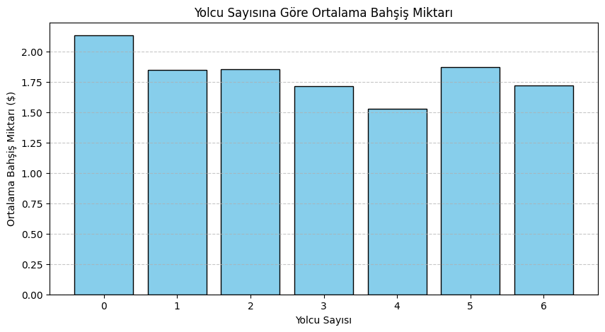
    


Yolcu miktarına göre bahşiş miktarında bir değişme olmuyor tuhaf bir şekilde 4 kişi olunduğunda bahşiş miktarı azalıyor en çok ise bahşiş 1 ve 2 kişi varken oluyor 


```python
# Create a month column
df['month'] = df['tpep_pickup_datetime'].dt.month_name()
# Create a day column
df['day'] = df['tpep_pickup_datetime'].dt.day_name()
```


```python
monthly_rides = df['month'].value_counts()
monthly_rides
```


    month
    March        2049
    October      2027
    April        2019
    May          2013
    January      1997
    June         1964
    December     1863
    November     1843
    February     1769
    September    1734
    August       1724
    July         1697
    Name: count, dtype: int64


```python
# Reorder the monthly ride list so months go in order
month_order = ['January', 'February', 'March', 'April', 'May', 'June', 'July',
         'August', 'September', 'October', 'November', 'December']

monthly_rides = monthly_rides.reindex(index=month_order)
monthly_rides
```


    month
    January      1997
    February     1769
    March        2049
    April        2019
    May          2013
    June         1964
    July         1697
    August       1724
    September    1734
    October      2027
    November     1843
    December     1863
    Name: count, dtype: int64


```python
# Create a bar plot of total rides per month
plt.figure(figsize=(12,7))
ax = sns.barplot(x=monthly_rides.index, y=monthly_rides)
ax.set_xticklabels(month_order)
plt.title('Ride count by month', fontsize=16);
```


    
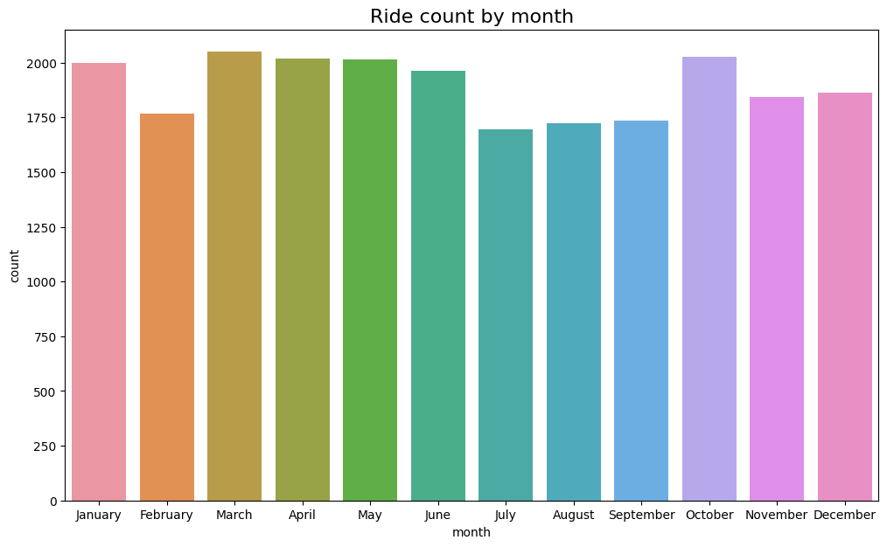
    


Genellikle her ay benzer miktarlarda sürüş yapılıyor yaz aylarında gözle görülür bir azalma oluyor. Bunun sebebi yaz aylarında insanların tatile gitmesi veya yürümeyi, bisiklet sürmeyi tercih etmesi olabilir. 


```python
daily_rides = df['day'].value_counts()
day_order = ['Monday', 'Tuesday', 'Wednesday', 'Thursday', 'Friday', 'Saturday', 'Sunday']
daily_rides = daily_rides.reindex(index=day_order)
daily_rides
```


    day
    Monday       2931
    Tuesday      3198
    Wednesday    3390
    Thursday     3402
    Friday       3413
    Saturday     3367
    Sunday       2998
    Name: count, dtype: int64


```python
# Create bar plot for ride count by day
plt.figure(figsize=(7,5))
ax = sns.barplot(x=daily_rides.index, y=daily_rides)
ax.set_xticklabels(day_order)
ax.set_ylabel('Count')
plt.title('Günlük sürüş miktarı', fontsize=16);
```


    
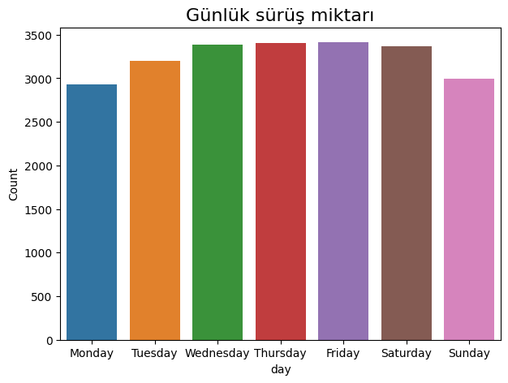
    


Pazartesi ve pazar günleri daha az oluyor. Yaklaşık olarak 500 günlük sürüş daha az oluyor geri kalan günler ise neredeyse aynı 


```python
# Repeat the process, this time for total revenue by day
total_amount_day = df.groupby('day')[['total_amount']].sum()
total_amount_day = total_amount_day.reindex(index=day_order)
total_amount_day
```


<div>
<style scoped>
    .dataframe tbody tr th:only-of-type {
        vertical-align: middle;
    }

    .dataframe tbody tr th {
        vertical-align: top;
    }

    .dataframe thead th {
        text-align: right;
    }
</style>
<table border="1" class="dataframe">
  <thead>
    <tr style="text-align: right;">
      <th></th>
      <th>total_amount</th>
    </tr>
    <tr>
      <th>day</th>
      <th></th>
    </tr>
  </thead>
  <tbody>
    <tr>
      <th>Monday</th>
      <td>49582.47</td>
    </tr>
    <tr>
      <th>Tuesday</th>
      <td>52530.94</td>
    </tr>
    <tr>
      <th>Wednesday</th>
      <td>55317.57</td>
    </tr>
    <tr>
      <th>Thursday</th>
      <td>57190.51</td>
    </tr>
    <tr>
      <th>Friday</th>
      <td>55830.34</td>
    </tr>
    <tr>
      <th>Saturday</th>
      <td>51325.30</td>
    </tr>
    <tr>
      <th>Sunday</th>
      <td>48634.66</td>
    </tr>
  </tbody>
</table>
</div>


```python
plt.figure(figsize=(7,5))
ax = sns.barplot(x=total_amount_day.index, y=total_amount_day['total_amount'])
ax.set_xticklabels(day_order)
ax.set_ylabel('Revenue (USD)')
plt.title('Total revenue by day', fontsize=16);
```


    
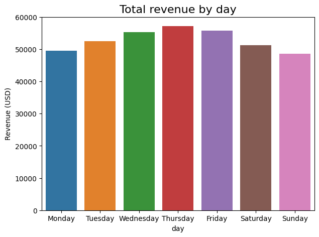
    


Çarşamba, perşembe ve cuma günleri sürüş sayısı fazlaydı buna bağlı olarak bu günlerde cironunda yüksek olmasını bekleriz. Dikkate değer bir farklılık ise pazartesi günü sürüş sayısı az olsa da ciro daha fazla cumartesi ise tam tersi.


```python
# Günlük olarak ciro / sürüş miktarı ile hangi günün daha karlı olduğunu bulalım 
daily_revenue_per_ride = total_amount_day['total_amount'] / daily_rides
daily_revenue_per_ride
```


    day
    Monday       16.916571
    Tuesday      16.426185
    Wednesday    16.317867
    Thursday     16.810850
    Friday       16.358142
    Saturday     15.243629
    Sunday       16.222368
    dtype: float64


```python
plt.figure(figsize=(7,5))
ax = sns.barplot(x=daily_revenue_per_ride.index, y=daily_revenue_per_ride)
ax.set_xticklabels(day_order)
ax.set_ylabel('Revenue (USD)')
plt.title('Total revenue by day', fontsize=16);
```


    
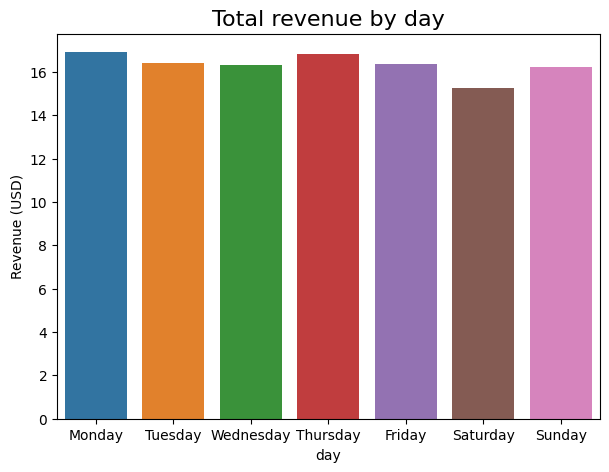
    


Buradan görebileceğimiz üzere yaklaşık olarak günlük sürüş başına revenue aynı 


```python
# Repeat the process, this time for total revenue by month
total_amount_month = df.groupby('month')[['total_amount']].sum()
total_amount_month = total_amount_month.reindex(index=month_order)
total_amount_month
```


<div>
<style scoped>
    .dataframe tbody tr th:only-of-type {
        vertical-align: middle;
    }

    .dataframe tbody tr th {
        vertical-align: top;
    }

    .dataframe thead th {
        text-align: right;
    }
</style>
<table border="1" class="dataframe">
  <thead>
    <tr style="text-align: right;">
      <th></th>
      <th>total_amount</th>
    </tr>
    <tr>
      <th>month</th>
      <th></th>
    </tr>
  </thead>
  <tbody>
    <tr>
      <th>January</th>
      <td>31739.05</td>
    </tr>
    <tr>
      <th>February</th>
      <td>28943.69</td>
    </tr>
    <tr>
      <th>March</th>
      <td>33091.69</td>
    </tr>
    <tr>
      <th>April</th>
      <td>32137.14</td>
    </tr>
    <tr>
      <th>May</th>
      <td>33832.38</td>
    </tr>
    <tr>
      <th>June</th>
      <td>32924.82</td>
    </tr>
    <tr>
      <th>July</th>
      <td>26626.24</td>
    </tr>
    <tr>
      <th>August</th>
      <td>27759.56</td>
    </tr>
    <tr>
      <th>September</th>
      <td>28211.18</td>
    </tr>
    <tr>
      <th>October</th>
      <td>33070.63</td>
    </tr>
    <tr>
      <th>November</th>
      <td>30804.74</td>
    </tr>
    <tr>
      <th>December</th>
      <td>31270.67</td>
    </tr>
  </tbody>
</table>
</div>


```python
# Create a bar plot of total revenue by month
plt.figure(figsize=(12,7))
ax = sns.barplot(x=total_amount_month.index, y=total_amount_month['total_amount'])
plt.title('Total revenue by month', fontsize=16);
```


    
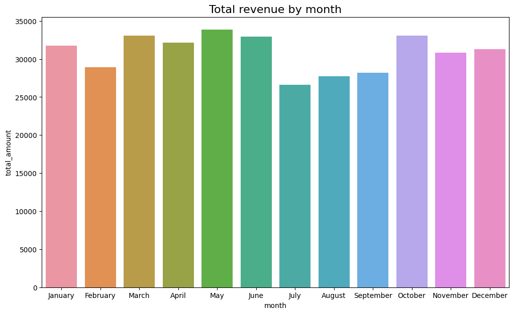
    


Genel olarak aylık kazanç aylık sürüş sayısı ile orantılı diyebiliriz


```python
# Get number of non unique drop-off location IDs
df['DOLocationID'].nunique()
```


    216


```python
# Calculate the mean trip distance for each drop-off location
distance_by_dropoff = df.groupby('DOLocationID')[['trip_distance']].mean()

# Sort the results in descending order by mean trip distance
distance_by_dropoff = distance_by_dropoff.sort_values(by='trip_distance')
distance_by_dropoff 
```


<div>
<style scoped>
    .dataframe tbody tr th:only-of-type {
        vertical-align: middle;
    }

    .dataframe tbody tr th {
        vertical-align: top;
    }

    .dataframe thead th {
        text-align: right;
    }
</style>
<table border="1" class="dataframe">
  <thead>
    <tr style="text-align: right;">
      <th></th>
      <th>trip_distance</th>
    </tr>
    <tr>
      <th>DOLocationID</th>
      <th></th>
    </tr>
  </thead>
  <tbody>
    <tr>
      <th>207</th>
      <td>1.200000</td>
    </tr>
    <tr>
      <th>193</th>
      <td>1.390556</td>
    </tr>
    <tr>
      <th>237</th>
      <td>1.555494</td>
    </tr>
    <tr>
      <th>234</th>
      <td>1.727806</td>
    </tr>
    <tr>
      <th>137</th>
      <td>1.818852</td>
    </tr>
    <tr>
      <th>...</th>
      <td>...</td>
    </tr>
    <tr>
      <th>51</th>
      <td>17.310000</td>
    </tr>
    <tr>
      <th>11</th>
      <td>17.945000</td>
    </tr>
    <tr>
      <th>210</th>
      <td>20.500000</td>
    </tr>
    <tr>
      <th>29</th>
      <td>21.650000</td>
    </tr>
    <tr>
      <th>23</th>
      <td>24.275000</td>
    </tr>
  </tbody>
</table>
<p>216 rows × 1 columns</p>
</div>


```python
# Create a bar plot of mean trip distances by drop-off location in ascending order by distance
plt.figure(figsize=(14,6))
ax = sns.barplot(x=distance_by_dropoff.index, 
                 y=distance_by_dropoff['trip_distance'],
                 order=distance_by_dropoff.index)
ax.set_xticklabels([])
ax.set_xticks([])
plt.title('Mean trip distance by drop-off location', fontsize=16);
```


    
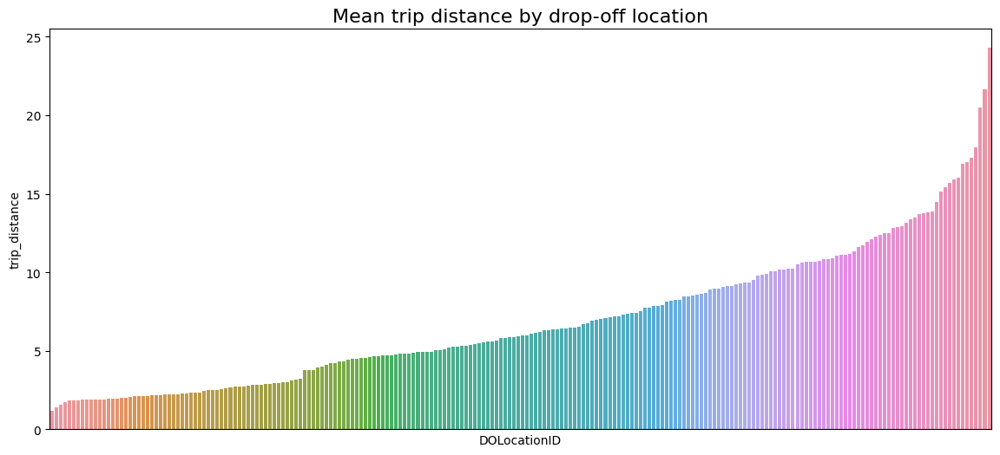
    


```python
df['trip_duration'] = (df['tpep_dropoff_datetime']-df['tpep_pickup_datetime'])
```


```python
df.head(10)
```


<div>
<style scoped>
    .dataframe tbody tr th:only-of-type {
        vertical-align: middle;
    }

    .dataframe tbody tr th {
        vertical-align: top;
    }

    .dataframe thead th {
        text-align: right;
    }
</style>
<table border="1" class="dataframe">
  <thead>
    <tr style="text-align: right;">
      <th></th>
      <th>Unnamed: 0</th>
      <th>VendorID</th>
      <th>tpep_pickup_datetime</th>
      <th>tpep_dropoff_datetime</th>
      <th>passenger_count</th>
      <th>trip_distance</th>
      <th>RatecodeID</th>
      <th>store_and_fwd_flag</th>
      <th>PULocationID</th>
      <th>DOLocationID</th>
      <th>...</th>
      <th>fare_amount</th>
      <th>extra</th>
      <th>mta_tax</th>
      <th>tip_amount</th>
      <th>tolls_amount</th>
      <th>improvement_surcharge</th>
      <th>total_amount</th>
      <th>month</th>
      <th>day</th>
      <th>trip_duration</th>
    </tr>
  </thead>
  <tbody>
    <tr>
      <th>0</th>
      <td>24870114</td>
      <td>2</td>
      <td>2017-03-25 08:55:43</td>
      <td>2017-03-25 09:09:47</td>
      <td>6</td>
      <td>3.34</td>
      <td>1</td>
      <td>N</td>
      <td>100</td>
      <td>231</td>
      <td>...</td>
      <td>13.0</td>
      <td>0.0</td>
      <td>0.5</td>
      <td>2.76</td>
      <td>0.0</td>
      <td>0.3</td>
      <td>16.56</td>
      <td>March</td>
      <td>Saturday</td>
      <td>0 days 00:14:04</td>
    </tr>
    <tr>
      <th>1</th>
      <td>35634249</td>
      <td>1</td>
      <td>2017-04-11 14:53:28</td>
      <td>2017-04-11 15:19:58</td>
      <td>1</td>
      <td>1.80</td>
      <td>1</td>
      <td>N</td>
      <td>186</td>
      <td>43</td>
      <td>...</td>
      <td>16.0</td>
      <td>0.0</td>
      <td>0.5</td>
      <td>4.00</td>
      <td>0.0</td>
      <td>0.3</td>
      <td>20.80</td>
      <td>April</td>
      <td>Tuesday</td>
      <td>0 days 00:26:30</td>
    </tr>
    <tr>
      <th>2</th>
      <td>106203690</td>
      <td>1</td>
      <td>2017-12-15 07:26:56</td>
      <td>2017-12-15 07:34:08</td>
      <td>1</td>
      <td>1.00</td>
      <td>1</td>
      <td>N</td>
      <td>262</td>
      <td>236</td>
      <td>...</td>
      <td>6.5</td>
      <td>0.0</td>
      <td>0.5</td>
      <td>1.45</td>
      <td>0.0</td>
      <td>0.3</td>
      <td>8.75</td>
      <td>December</td>
      <td>Friday</td>
      <td>0 days 00:07:12</td>
    </tr>
    <tr>
      <th>3</th>
      <td>38942136</td>
      <td>2</td>
      <td>2017-05-07 13:17:59</td>
      <td>2017-05-07 13:48:14</td>
      <td>1</td>
      <td>3.70</td>
      <td>1</td>
      <td>N</td>
      <td>188</td>
      <td>97</td>
      <td>...</td>
      <td>20.5</td>
      <td>0.0</td>
      <td>0.5</td>
      <td>6.39</td>
      <td>0.0</td>
      <td>0.3</td>
      <td>27.69</td>
      <td>May</td>
      <td>Sunday</td>
      <td>0 days 00:30:15</td>
    </tr>
    <tr>
      <th>4</th>
      <td>30841670</td>
      <td>2</td>
      <td>2017-04-15 23:32:20</td>
      <td>2017-04-15 23:49:03</td>
      <td>1</td>
      <td>4.37</td>
      <td>1</td>
      <td>N</td>
      <td>4</td>
      <td>112</td>
      <td>...</td>
      <td>16.5</td>
      <td>0.5</td>
      <td>0.5</td>
      <td>0.00</td>
      <td>0.0</td>
      <td>0.3</td>
      <td>17.80</td>
      <td>April</td>
      <td>Saturday</td>
      <td>0 days 00:16:43</td>
    </tr>
    <tr>
      <th>5</th>
      <td>23345809</td>
      <td>2</td>
      <td>2017-03-25 20:34:11</td>
      <td>2017-03-25 20:42:11</td>
      <td>6</td>
      <td>2.30</td>
      <td>1</td>
      <td>N</td>
      <td>161</td>
      <td>236</td>
      <td>...</td>
      <td>9.0</td>
      <td>0.5</td>
      <td>0.5</td>
      <td>2.06</td>
      <td>0.0</td>
      <td>0.3</td>
      <td>12.36</td>
      <td>March</td>
      <td>Saturday</td>
      <td>0 days 00:08:00</td>
    </tr>
    <tr>
      <th>6</th>
      <td>37660487</td>
      <td>2</td>
      <td>2017-05-03 19:04:09</td>
      <td>2017-05-03 20:03:47</td>
      <td>1</td>
      <td>12.83</td>
      <td>1</td>
      <td>N</td>
      <td>79</td>
      <td>241</td>
      <td>...</td>
      <td>47.5</td>
      <td>1.0</td>
      <td>0.5</td>
      <td>9.86</td>
      <td>0.0</td>
      <td>0.3</td>
      <td>59.16</td>
      <td>May</td>
      <td>Wednesday</td>
      <td>0 days 00:59:38</td>
    </tr>
    <tr>
      <th>7</th>
      <td>69059411</td>
      <td>2</td>
      <td>2017-08-15 17:41:06</td>
      <td>2017-08-15 18:03:05</td>
      <td>1</td>
      <td>2.98</td>
      <td>1</td>
      <td>N</td>
      <td>237</td>
      <td>114</td>
      <td>...</td>
      <td>16.0</td>
      <td>1.0</td>
      <td>0.5</td>
      <td>1.78</td>
      <td>0.0</td>
      <td>0.3</td>
      <td>19.58</td>
      <td>August</td>
      <td>Tuesday</td>
      <td>0 days 00:21:59</td>
    </tr>
    <tr>
      <th>8</th>
      <td>8433159</td>
      <td>2</td>
      <td>2017-02-04 16:17:07</td>
      <td>2017-02-04 16:29:14</td>
      <td>1</td>
      <td>1.20</td>
      <td>1</td>
      <td>N</td>
      <td>234</td>
      <td>249</td>
      <td>...</td>
      <td>9.0</td>
      <td>0.0</td>
      <td>0.5</td>
      <td>0.00</td>
      <td>0.0</td>
      <td>0.3</td>
      <td>9.80</td>
      <td>February</td>
      <td>Saturday</td>
      <td>0 days 00:12:07</td>
    </tr>
    <tr>
      <th>9</th>
      <td>95294817</td>
      <td>1</td>
      <td>2017-11-10 15:20:29</td>
      <td>2017-11-10 15:40:55</td>
      <td>1</td>
      <td>1.60</td>
      <td>1</td>
      <td>N</td>
      <td>239</td>
      <td>237</td>
      <td>...</td>
      <td>13.0</td>
      <td>0.0</td>
      <td>0.5</td>
      <td>2.75</td>
      <td>0.0</td>
      <td>0.3</td>
      <td>16.55</td>
      <td>November</td>
      <td>Friday</td>
      <td>0 days 00:20:26</td>
    </tr>
  </tbody>
</table>
<p>10 rows × 21 columns</p>
</div>


## Sonuç
### Yapılanlar : 
- Verilerin anlamları için sütun oluşturuldu
- boş satırlar ve sütunlar incelendi temizlendi
- kopyalanmış satır ve sütunlar incelendi temizlendi
- Hatalı değerler düzeltildi
### Sonra yapılacaklar 
- Outliers değerleri bulundu. Görselleştirme işleminden sonra bu deüerleri düzenle
- tpep_pickup_datetime ve tpep_dropoff_datetime arasındaki süre ile geçen zaman için bir değer oluşturulabilir
- Bazı veriler kategorik bunları ML için encoding yapabiliriz. 


# Görev 2 
analyze the relationship between fare amount and payment type.

The goal is to apply descriptive statistics and hypothesis testing in Python. **The goal for this A/B test is to sample data and analyze whether there is a relationship between payment type and fare amount.**  For example: discover if customers who use credit cards pay higher fare amounts than customers who use cash.

## Verilerin anlamlandırılması


```python
df.head(3)
```


<div>
<style scoped>
    .dataframe tbody tr th:only-of-type {
        vertical-align: middle;
    }

    .dataframe tbody tr th {
        vertical-align: top;
    }

    .dataframe thead th {
        text-align: right;
    }
</style>
<table border="1" class="dataframe">
  <thead>
    <tr style="text-align: right;">
      <th></th>
      <th>Unnamed: 0</th>
      <th>VendorID</th>
      <th>tpep_pickup_datetime</th>
      <th>tpep_dropoff_datetime</th>
      <th>passenger_count</th>
      <th>trip_distance</th>
      <th>RatecodeID</th>
      <th>store_and_fwd_flag</th>
      <th>PULocationID</th>
      <th>DOLocationID</th>
      <th>...</th>
      <th>fare_amount</th>
      <th>extra</th>
      <th>mta_tax</th>
      <th>tip_amount</th>
      <th>tolls_amount</th>
      <th>improvement_surcharge</th>
      <th>total_amount</th>
      <th>month</th>
      <th>day</th>
      <th>trip_duration</th>
    </tr>
  </thead>
  <tbody>
    <tr>
      <th>0</th>
      <td>24870114</td>
      <td>2</td>
      <td>2017-03-25 08:55:43</td>
      <td>2017-03-25 09:09:47</td>
      <td>6</td>
      <td>3.34</td>
      <td>1</td>
      <td>N</td>
      <td>100</td>
      <td>231</td>
      <td>...</td>
      <td>13.0</td>
      <td>0.0</td>
      <td>0.5</td>
      <td>2.76</td>
      <td>0.0</td>
      <td>0.3</td>
      <td>16.56</td>
      <td>March</td>
      <td>Saturday</td>
      <td>0 days 00:14:04</td>
    </tr>
    <tr>
      <th>1</th>
      <td>35634249</td>
      <td>1</td>
      <td>2017-04-11 14:53:28</td>
      <td>2017-04-11 15:19:58</td>
      <td>1</td>
      <td>1.80</td>
      <td>1</td>
      <td>N</td>
      <td>186</td>
      <td>43</td>
      <td>...</td>
      <td>16.0</td>
      <td>0.0</td>
      <td>0.5</td>
      <td>4.00</td>
      <td>0.0</td>
      <td>0.3</td>
      <td>20.80</td>
      <td>April</td>
      <td>Tuesday</td>
      <td>0 days 00:26:30</td>
    </tr>
    <tr>
      <th>2</th>
      <td>106203690</td>
      <td>1</td>
      <td>2017-12-15 07:26:56</td>
      <td>2017-12-15 07:34:08</td>
      <td>1</td>
      <td>1.00</td>
      <td>1</td>
      <td>N</td>
      <td>262</td>
      <td>236</td>
      <td>...</td>
      <td>6.5</td>
      <td>0.0</td>
      <td>0.5</td>
      <td>1.45</td>
      <td>0.0</td>
      <td>0.3</td>
      <td>8.75</td>
      <td>December</td>
      <td>Friday</td>
      <td>0 days 00:07:12</td>
    </tr>
  </tbody>
</table>
<p>3 rows × 21 columns</p>
</div>


### payment type inceleyelim 
A numeric code signifying how the passenger paid for the trip.  

1= Credit card 

2= Cash 

3= No charge 

4= Dispute 

5= Unknown 

6= Voided trip


```python

print( "Ödeme yöntemleri ve sayıları ",df["payment_type"].value_counts())
print( "Ödeme yöntem oranları ",df["payment_type"].value_counts(normalize = True))
```

    Ödeme yöntemleri ve sayıları  payment_type
    1    15265
    2     7267
    3      121
    4       46
    Name: count, dtype: int64
    Ödeme yöntem oranları  payment_type
    1    0.672497
    2    0.320146
    3    0.005331
    4    0.002027
    Name: proportion, dtype: float64


Ödemelerin : 
- %67 si kredi kartı ile
- %32 si nakit ile ödeniyor


```python
# Ödeme türlerine göre ortalama ulaşım ücreti ne kadar ? 
df.groupby('payment_type')['fare_amount'].mean()
```


    payment_type
    1    13.429748
    2    12.213546
    3    12.367934
    4    12.989130
    Name: fare_amount, dtype: float64


## Hipotez testi 
𝐻0
 : There is no difference in the average fare amount between customers who use credit cards and customers who use cash.

𝐻𝐴
 : There is a difference in the average fare amount between customers who use credit cards and customers who use cash.


```python
# import 
from scipy import stats
```


```python
# T testi uygulayacağız
credit_card = df[df['payment_type'] == 1]['fare_amount']
cash = df[df['payment_type'] == 2]['fare_amount']
stats.ttest_ind(a=credit_card, b=cash, equal_var=False)
```


    TtestResult(statistic=6.866800855655361, pvalue=6.7973874730310106e-12, df=16675.48547403633)


P değeri 0.05 değerinden daha küçük olduğu için H0 hipotezini reddediyoruz. 
Kredi kartı kullanarak ulaşım ücretini ödeyenler ile nakit ödeyen müşterilerin arasında istatiksel olarak farklılık var 

# Görev 3 
to build a multiple linear regression model to predict taxi fares using existing data that was collected over the course of a year. 
**The goal** is to build a multiple linear regression model and evaluate the model
<br/>
*This activity has three parts:*

**Part 1:** EDA & Checking Model Assumptions
* What are some purposes of EDA before constructing a multiple linear regression model?

**Part 2:** Model Building and evaluation
* What resources do you find yourself using as you complete this stage?

**Part 3:** Interpreting Model Results

* What key insights emerged from your model(s)?

* What business recommendations do you propose based on the models built?


```python
# Sadece sayısal sütunları seç
numeric_columns = df.select_dtypes(include=['number']).columns

# Korelasyon matrisini hesapla
correlation_matrix = df[numeric_columns].corr()
# Grafik boyutunu ayarla
plt.figure(figsize=(20, 10))

# Korelasyon matrisini çiz
sns.heatmap(correlation_matrix, annot=True, cmap="coolwarm", fmt=".2f", linewidths=0.5)

# Başlık ekle
plt.title("Korelasyon Matrisi")

# Grafiği göster
plt.show()
```


    
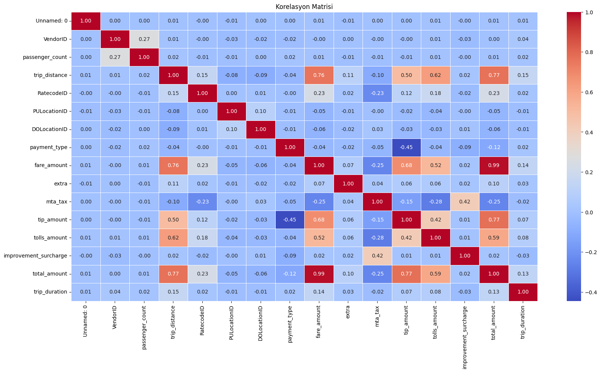
    


```python
# Create `duration` column
df['duration'] = (df['tpep_dropoff_datetime'] - df['tpep_pickup_datetime'])/np.timedelta64(1,'m')
```

Doğru orantılı 
- tip_amount
- trip_distance
- tolls_amount
- trip_duration

Ters orantılı - mta_tax

## Outliers düzenleme
Lineer regresyon ile tahmin yaparken outliers modelimizi kötü etkileyebilir bu aşamada outliers değerlerini düzenlemek gerekiyor 


```python
# Bu değişkenler en çok fiyata etki eden değişkenler
fig, axes = plt.subplots(1, 4, figsize=(20, 2))
fig.suptitle('Boxplots for outlier detection')
sns.boxplot(ax=axes[0], x=df['trip_distance'])
sns.boxplot(ax=axes[1], x=df['fare_amount'])
sns.boxplot(ax=axes[2], x=df['duration'])
sns.boxplot(ax=axes[3], x=df['tip_amount'])
plt.show();
```


    
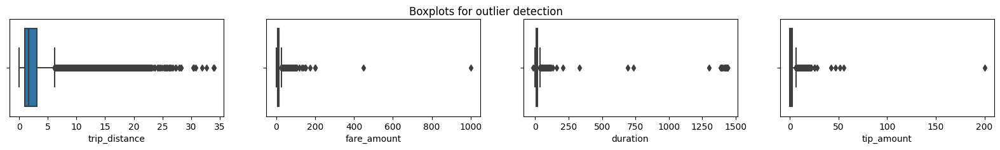
    


```python
def outlier_counter(column_list, iqr_factor):
    '''
    Impute upper-limit values in specified columns based on their interquartile range.

    Arguments:
        column_list: A list of columns to iterate over
        iqr_factor: A number representing x in the formula:
                    Q3 + (x * IQR). Used to determine maximum threshold,
                    beyond which a point is considered an outlier.

    The IQR is computed for each column in column_list and values exceeding
    the upper threshold for each column are imputed with the upper threshold value.
    '''
    for col in column_list:
        # Reassign minimum to zero
        df.loc[df[col] < 0, col] = 0

        # Calculate upper threshold
        q1 = df[col].quantile(0.25)
        q3 = df[col].quantile(0.75)
        iqr = q3 - q1
        upper_threshold = q3 + (iqr_factor * iqr)
        # Count the number of outliers
        outliers_count = df[df[col] > upper_threshold][col].count()
        # print(col)
        # print('q3:', q3)
        # print('upper_threshold:', upper_threshold)
        print(f"outliers count -> {col}:",outliers_count )
        # print(df[col].describe())
        
        print()
```


```python
outliers_column_list = ["tip_amount", "trip_distance" , "duration","fare_amount"]
outlier_counter(outliers_column_list, 6)
```

    outliers count -> tip_amount: 39
    
    outliers count -> trip_distance: 600
    
    outliers count -> duration: 71
    
    outliers count -> fare_amount: 82
    


6 IQR da bile yukarıdaki değerlerde veri outliers dışında kalıyor ne yapabiliriz ? 


```python
df1 = df.copy()
```


```python
def outlier_imputer(column_list, iqr_factor):
    '''
    Impute upper-limit values in specified columns based on their interquartile range.

    Arguments:
        column_list: A list of columns to iterate over
        iqr_factor: A number representing x in the formula:
                    Q3 + (x * IQR). Used to determine maximum threshold,
                    beyond which a point is considered an outlier.

    The IQR is computed for each column in column_list and values exceeding
    the upper threshold for each column are imputed with the upper threshold value.
    '''
    for col in column_list:
        # Reassign minimum to zero
        df1.loc[df1[col] < 0, col] = 0

        # Calculate upper threshold
        q1 = df1[col].quantile(0.25)
        q3 = df1[col].quantile(0.75)
        iqr = q3 - q1
        upper_threshold = q3 + (iqr_factor * iqr)
        print(col)
        print('q3:', q3)
        print('upper_threshold:', upper_threshold)

        # Reassign values > threshold to threshold
        df1.loc[df1[col] > upper_threshold, col] = upper_threshold
        print(df1[col].describe())
        
        print()
```


```python
outlier_imputer(outliers_column_list, 6)
```

    tip_amount
    q3: 2.45
    upper_threshold: 17.150000000000002
    count    22699.000000
    mean         1.818543
    std          2.374812
    min          0.000000
    25%          0.000000
    50%          1.350000
    75%          2.450000
    max         17.150000
    Name: tip_amount, dtype: float64
    
    trip_distance
    q3: 3.06
    upper_threshold: 15.480000000000002
    count    22699.000000
    mean         2.823424
    std          3.252029
    min          0.000000
    25%          0.990000
    50%          1.610000
    75%          3.060000
    max         15.480000
    Name: trip_distance, dtype: float64
    
    duration
    q3: 18.383333333333333
    upper_threshold: 88.78333333333333
    count    22699.000000
    mean        14.460555
    std         11.947043
    min          0.000000
    25%          6.650000
    50%         11.183333
    75%         18.383333
    max         88.783333
    Name: duration, dtype: float64
    
    fare_amount
    q3: 14.5
    upper_threshold: 62.5
    count    22699.000000
    mean        12.897913
    std         10.541137
    min          0.000000
    25%          6.500000
    50%          9.500000
    75%         14.500000
    max         62.500000
    Name: fare_amount, dtype: float64
    


## Feature engineering 


```python
pd.set_option('display.max_columns', None) #tüm columnları görmek için 
df1.head(3)
```


<div>
<style scoped>
    .dataframe tbody tr th:only-of-type {
        vertical-align: middle;
    }

    .dataframe tbody tr th {
        vertical-align: top;
    }

    .dataframe thead th {
        text-align: right;
    }
</style>
<table border="1" class="dataframe">
  <thead>
    <tr style="text-align: right;">
      <th></th>
      <th>Unnamed: 0</th>
      <th>VendorID</th>
      <th>tpep_pickup_datetime</th>
      <th>tpep_dropoff_datetime</th>
      <th>passenger_count</th>
      <th>trip_distance</th>
      <th>RatecodeID</th>
      <th>store_and_fwd_flag</th>
      <th>PULocationID</th>
      <th>DOLocationID</th>
      <th>payment_type</th>
      <th>fare_amount</th>
      <th>extra</th>
      <th>mta_tax</th>
      <th>tip_amount</th>
      <th>tolls_amount</th>
      <th>improvement_surcharge</th>
      <th>total_amount</th>
      <th>month</th>
      <th>day</th>
      <th>trip_duration</th>
      <th>duration</th>
    </tr>
  </thead>
  <tbody>
    <tr>
      <th>0</th>
      <td>24870114</td>
      <td>2</td>
      <td>2017-03-25 08:55:43</td>
      <td>2017-03-25 09:09:47</td>
      <td>6</td>
      <td>3.34</td>
      <td>1</td>
      <td>N</td>
      <td>100</td>
      <td>231</td>
      <td>1</td>
      <td>13.0</td>
      <td>0.0</td>
      <td>0.5</td>
      <td>2.76</td>
      <td>0.0</td>
      <td>0.3</td>
      <td>16.56</td>
      <td>March</td>
      <td>Saturday</td>
      <td>0 days 00:14:04</td>
      <td>14.066667</td>
    </tr>
    <tr>
      <th>1</th>
      <td>35634249</td>
      <td>1</td>
      <td>2017-04-11 14:53:28</td>
      <td>2017-04-11 15:19:58</td>
      <td>1</td>
      <td>1.80</td>
      <td>1</td>
      <td>N</td>
      <td>186</td>
      <td>43</td>
      <td>1</td>
      <td>16.0</td>
      <td>0.0</td>
      <td>0.5</td>
      <td>4.00</td>
      <td>0.0</td>
      <td>0.3</td>
      <td>20.80</td>
      <td>April</td>
      <td>Tuesday</td>
      <td>0 days 00:26:30</td>
      <td>26.500000</td>
    </tr>
    <tr>
      <th>2</th>
      <td>106203690</td>
      <td>1</td>
      <td>2017-12-15 07:26:56</td>
      <td>2017-12-15 07:34:08</td>
      <td>1</td>
      <td>1.00</td>
      <td>1</td>
      <td>N</td>
      <td>262</td>
      <td>236</td>
      <td>1</td>
      <td>6.5</td>
      <td>0.0</td>
      <td>0.5</td>
      <td>1.45</td>
      <td>0.0</td>
      <td>0.3</td>
      <td>8.75</td>
      <td>December</td>
      <td>Friday</td>
      <td>0 days 00:07:12</td>
      <td>7.200000</td>
    </tr>
  </tbody>
</table>
</div>


```python
# Create a scatter plot of duration and trip_distance, with a line of best fit
sns.set(style='whitegrid')
f = plt.figure()
f.set_figwidth(5)
f.set_figheight(5)
sns.regplot(x=df1['trip_distance'], y=df1['fare_amount'],
            scatter_kws={'alpha':0.5, 's':5},
            line_kws={'color':'red'})
plt.ylim(0, 70)
plt.xlim(0, 70)
plt.title('Mean duration x fare amount')
plt.show()
```


    
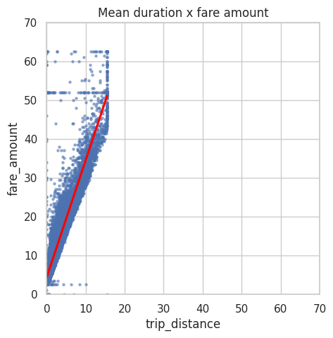
    


```python
# Create a scatter plot of duration and trip_distance, with a line of best fit
sns.set(style='whitegrid')
f = plt.figure()
f.set_figwidth(5)
f.set_figheight(5)
sns.regplot(x=df1['duration'], y=df1['fare_amount'],
            scatter_kws={'alpha':0.5, 's':5},
            line_kws={'color':'red'})

plt.title('Mean duration x fare amount')
plt.show()
```


    
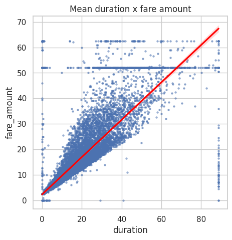
    


### Başlangıç Bitiş noktaları belirle
Kişinin bindiği nokta ile indiği noktayı biliresk arasındaki mesafe ve süre gibi durumlar tahmin edilebilir olacağı için fiyat tahmin etmesi de kolay olacaktır 


```python
# Create `pickup_dropoff` column
# amacımız başlangıç ve bitiş kordinatları ile özel bir kod oluşturmak bunun için sayısal kordiinat
# değerlerini str dönüştürüyoruz 
df1['pickup_dropoff'] = df1['PULocationID'].astype(str) + ' ' + df1['DOLocationID'].astype(str)
df1['pickup_dropoff'].head(10)
```


    0    100 231
    1     186 43
    2    262 236
    3     188 97
    4      4 112
    5    161 236
    6     79 241
    7    237 114
    8    234 249
    9    239 237
    Name: pickup_dropoff, dtype: object


```python
# Bu özel kodları gruplandırıyoruz ve mesafelerin ortalmasını alıyoruz 
grouped = df1.groupby('pickup_dropoff').mean(numeric_only=True)[['trip_distance']]
grouped[:10]
```


<div>
<style scoped>
    .dataframe tbody tr th:only-of-type {
        vertical-align: middle;
    }

    .dataframe tbody tr th {
        vertical-align: top;
    }

    .dataframe thead th {
        text-align: right;
    }
</style>
<table border="1" class="dataframe">
  <thead>
    <tr style="text-align: right;">
      <th></th>
      <th>trip_distance</th>
    </tr>
    <tr>
      <th>pickup_dropoff</th>
      <th></th>
    </tr>
  </thead>
  <tbody>
    <tr>
      <th>1 1</th>
      <td>2.433333</td>
    </tr>
    <tr>
      <th>10 148</th>
      <td>15.480000</td>
    </tr>
    <tr>
      <th>100 1</th>
      <td>15.480000</td>
    </tr>
    <tr>
      <th>100 100</th>
      <td>0.253333</td>
    </tr>
    <tr>
      <th>100 107</th>
      <td>1.180000</td>
    </tr>
    <tr>
      <th>100 113</th>
      <td>2.024000</td>
    </tr>
    <tr>
      <th>100 114</th>
      <td>1.940000</td>
    </tr>
    <tr>
      <th>100 12</th>
      <td>4.550000</td>
    </tr>
    <tr>
      <th>100 125</th>
      <td>2.840000</td>
    </tr>
    <tr>
      <th>100 13</th>
      <td>4.201667</td>
    </tr>
  </tbody>
</table>
</div>


```python
# 1. Convert `grouped` to a dictionary
grouped_dict = grouped.to_dict()

# 2. Reassign to only contain the inner dictionary
grouped_dict = grouped_dict['trip_distance']
```


```python
# 1. Create a mean_distance column that is a copy of the pickup_dropoff helper column
df1['mean_distance'] = df1['pickup_dropoff']

# 2. Map `grouped_dict` to the `mean_distance` column
df1['mean_distance'] = df1['mean_distance'].map(grouped_dict)

# Confirm that it worked
df1[(df1['PULocationID']==100) & (df1['DOLocationID']==231)][['mean_distance']]
```


<div>
<style scoped>
    .dataframe tbody tr th:only-of-type {
        vertical-align: middle;
    }

    .dataframe tbody tr th {
        vertical-align: top;
    }

    .dataframe thead th {
        text-align: right;
    }
</style>
<table border="1" class="dataframe">
  <thead>
    <tr style="text-align: right;">
      <th></th>
      <th>mean_distance</th>
    </tr>
  </thead>
  <tbody>
    <tr>
      <th>0</th>
      <td>3.521667</td>
    </tr>
    <tr>
      <th>4909</th>
      <td>3.521667</td>
    </tr>
    <tr>
      <th>16636</th>
      <td>3.521667</td>
    </tr>
    <tr>
      <th>18134</th>
      <td>3.521667</td>
    </tr>
    <tr>
      <th>19761</th>
      <td>3.521667</td>
    </tr>
    <tr>
      <th>20581</th>
      <td>3.521667</td>
    </tr>
  </tbody>
</table>
</div>


```python
grouped = df1.groupby('pickup_dropoff').mean(numeric_only=True)[['duration']]
grouped

# Create a dictionary where keys are unique pickup_dropoffs and values are
# mean trip duration for all trips with those pickup_dropoff combos
grouped_dict = grouped.to_dict()
grouped_dict = grouped_dict['duration']

df1['mean_duration'] = df1['pickup_dropoff']
df1['mean_duration'] = df1['mean_duration'].map(grouped_dict)

# Confirm that it worked
df1[(df1['PULocationID']==100) & (df1['DOLocationID']==231)][['mean_duration']]
```


<div>
<style scoped>
    .dataframe tbody tr th:only-of-type {
        vertical-align: middle;
    }

    .dataframe tbody tr th {
        vertical-align: top;
    }

    .dataframe thead th {
        text-align: right;
    }
</style>
<table border="1" class="dataframe">
  <thead>
    <tr style="text-align: right;">
      <th></th>
      <th>mean_duration</th>
    </tr>
  </thead>
  <tbody>
    <tr>
      <th>0</th>
      <td>22.847222</td>
    </tr>
    <tr>
      <th>4909</th>
      <td>22.847222</td>
    </tr>
    <tr>
      <th>16636</th>
      <td>22.847222</td>
    </tr>
    <tr>
      <th>18134</th>
      <td>22.847222</td>
    </tr>
    <tr>
      <th>19761</th>
      <td>22.847222</td>
    </tr>
    <tr>
      <th>20581</th>
      <td>22.847222</td>
    </tr>
  </tbody>
</table>
</div>


### Rush hour 
Bu özellik ile çok fazla acelenin olduğu saatlerdkei ekstrem davranışları görmeyi planlıyoruz


```python
# Create 'rush_hour' col
df1['rush_hour'] = df1['tpep_pickup_datetime'].dt.hour

# If day is Saturday or Sunday, impute 0 in `rush_hour` column
df1.loc[df1['day'].isin(['saturday', 'sunday']), 'rush_hour'] = 0
```


```python
def rush_hourizer(hour):
    if 6 <= hour['rush_hour'] < 10:
        val = 1
    elif 16 <= hour['rush_hour'] < 20:
        val = 1
    else:
        val = 0
    return val
```


```python
# Apply the `rush_hourizer()` function to the new column
df1.loc[(df1.day != 'saturday') & (df1.day != 'sunday'), 'rush_hour'] = df1.apply(rush_hourizer, axis=1)
df1.head()
```


<div>
<style scoped>
    .dataframe tbody tr th:only-of-type {
        vertical-align: middle;
    }

    .dataframe tbody tr th {
        vertical-align: top;
    }

    .dataframe thead th {
        text-align: right;
    }
</style>
<table border="1" class="dataframe">
  <thead>
    <tr style="text-align: right;">
      <th></th>
      <th>Unnamed: 0</th>
      <th>VendorID</th>
      <th>tpep_pickup_datetime</th>
      <th>tpep_dropoff_datetime</th>
      <th>passenger_count</th>
      <th>trip_distance</th>
      <th>RatecodeID</th>
      <th>store_and_fwd_flag</th>
      <th>PULocationID</th>
      <th>DOLocationID</th>
      <th>payment_type</th>
      <th>fare_amount</th>
      <th>extra</th>
      <th>mta_tax</th>
      <th>tip_amount</th>
      <th>tolls_amount</th>
      <th>improvement_surcharge</th>
      <th>total_amount</th>
      <th>month</th>
      <th>day</th>
      <th>trip_duration</th>
      <th>duration</th>
      <th>pickup_dropoff</th>
      <th>mean_distance</th>
      <th>mean_duration</th>
      <th>rush_hour</th>
    </tr>
  </thead>
  <tbody>
    <tr>
      <th>0</th>
      <td>24870114</td>
      <td>2</td>
      <td>2017-03-25 08:55:43</td>
      <td>2017-03-25 09:09:47</td>
      <td>6</td>
      <td>3.34</td>
      <td>1</td>
      <td>N</td>
      <td>100</td>
      <td>231</td>
      <td>1</td>
      <td>13.0</td>
      <td>0.0</td>
      <td>0.5</td>
      <td>2.76</td>
      <td>0.0</td>
      <td>0.3</td>
      <td>16.56</td>
      <td>March</td>
      <td>Saturday</td>
      <td>0 days 00:14:04</td>
      <td>14.066667</td>
      <td>100 231</td>
      <td>3.521667</td>
      <td>22.847222</td>
      <td>1</td>
    </tr>
    <tr>
      <th>1</th>
      <td>35634249</td>
      <td>1</td>
      <td>2017-04-11 14:53:28</td>
      <td>2017-04-11 15:19:58</td>
      <td>1</td>
      <td>1.80</td>
      <td>1</td>
      <td>N</td>
      <td>186</td>
      <td>43</td>
      <td>1</td>
      <td>16.0</td>
      <td>0.0</td>
      <td>0.5</td>
      <td>4.00</td>
      <td>0.0</td>
      <td>0.3</td>
      <td>20.80</td>
      <td>April</td>
      <td>Tuesday</td>
      <td>0 days 00:26:30</td>
      <td>26.500000</td>
      <td>186 43</td>
      <td>3.108889</td>
      <td>24.470370</td>
      <td>0</td>
    </tr>
    <tr>
      <th>2</th>
      <td>106203690</td>
      <td>1</td>
      <td>2017-12-15 07:26:56</td>
      <td>2017-12-15 07:34:08</td>
      <td>1</td>
      <td>1.00</td>
      <td>1</td>
      <td>N</td>
      <td>262</td>
      <td>236</td>
      <td>1</td>
      <td>6.5</td>
      <td>0.0</td>
      <td>0.5</td>
      <td>1.45</td>
      <td>0.0</td>
      <td>0.3</td>
      <td>8.75</td>
      <td>December</td>
      <td>Friday</td>
      <td>0 days 00:07:12</td>
      <td>7.200000</td>
      <td>262 236</td>
      <td>0.881429</td>
      <td>7.250000</td>
      <td>1</td>
    </tr>
    <tr>
      <th>3</th>
      <td>38942136</td>
      <td>2</td>
      <td>2017-05-07 13:17:59</td>
      <td>2017-05-07 13:48:14</td>
      <td>1</td>
      <td>3.70</td>
      <td>1</td>
      <td>N</td>
      <td>188</td>
      <td>97</td>
      <td>1</td>
      <td>20.5</td>
      <td>0.0</td>
      <td>0.5</td>
      <td>6.39</td>
      <td>0.0</td>
      <td>0.3</td>
      <td>27.69</td>
      <td>May</td>
      <td>Sunday</td>
      <td>0 days 00:30:15</td>
      <td>30.250000</td>
      <td>188 97</td>
      <td>3.700000</td>
      <td>30.250000</td>
      <td>0</td>
    </tr>
    <tr>
      <th>4</th>
      <td>30841670</td>
      <td>2</td>
      <td>2017-04-15 23:32:20</td>
      <td>2017-04-15 23:49:03</td>
      <td>1</td>
      <td>4.37</td>
      <td>1</td>
      <td>N</td>
      <td>4</td>
      <td>112</td>
      <td>2</td>
      <td>16.5</td>
      <td>0.5</td>
      <td>0.5</td>
      <td>0.00</td>
      <td>0.0</td>
      <td>0.3</td>
      <td>17.80</td>
      <td>April</td>
      <td>Saturday</td>
      <td>0 days 00:16:43</td>
      <td>16.716667</td>
      <td>4 112</td>
      <td>4.435000</td>
      <td>14.616667</td>
      <td>0</td>
    </tr>
  </tbody>
</table>
</div>


```python
# Create a scatter plot of duration and trip_distance, with a line of best fit
sns.set(style='whitegrid')
f = plt.figure()
f.set_figwidth(5)
f.set_figheight(5)
sns.regplot(x=df1['mean_duration'], y=df1['fare_amount'],
            scatter_kws={'alpha':0.5, 's':5},
            line_kws={'color':'red'})
plt.ylim(0, 70)
plt.xlim(0, 70)
plt.title('Mean duration x fare amount')
plt.show()
```


    
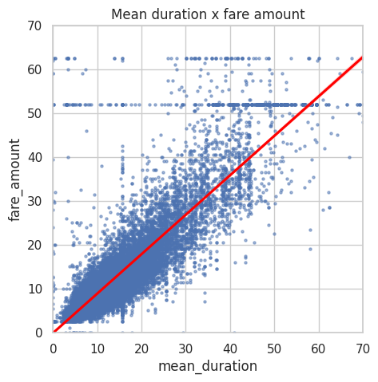
    


52 dolar seviyesinde sabit sayılar var peki bu ne anlama geliyor olabilir ? 


```python
df1[df1['fare_amount'] > 50]['fare_amount'].value_counts().head()
```


    fare_amount
    52.0    514
    62.5     84
    59.0      9
    50.5      9
    57.5      8
    Name: count, dtype: int64


```python
df1[df1['fare_amount'] == 52].head(30)
```


<div>
<style scoped>
    .dataframe tbody tr th:only-of-type {
        vertical-align: middle;
    }

    .dataframe tbody tr th {
        vertical-align: top;
    }

    .dataframe thead th {
        text-align: right;
    }
</style>
<table border="1" class="dataframe">
  <thead>
    <tr style="text-align: right;">
      <th></th>
      <th>Unnamed: 0</th>
      <th>VendorID</th>
      <th>tpep_pickup_datetime</th>
      <th>tpep_dropoff_datetime</th>
      <th>passenger_count</th>
      <th>trip_distance</th>
      <th>RatecodeID</th>
      <th>store_and_fwd_flag</th>
      <th>PULocationID</th>
      <th>DOLocationID</th>
      <th>payment_type</th>
      <th>fare_amount</th>
      <th>extra</th>
      <th>mta_tax</th>
      <th>tip_amount</th>
      <th>tolls_amount</th>
      <th>improvement_surcharge</th>
      <th>total_amount</th>
      <th>month</th>
      <th>day</th>
      <th>trip_duration</th>
      <th>duration</th>
      <th>pickup_dropoff</th>
      <th>mean_distance</th>
      <th>mean_duration</th>
      <th>rush_hour</th>
    </tr>
  </thead>
  <tbody>
    <tr>
      <th>11</th>
      <td>18600059</td>
      <td>2</td>
      <td>2017-03-05 19:15:30</td>
      <td>2017-03-05 19:52:18</td>
      <td>2</td>
      <td>15.48</td>
      <td>2</td>
      <td>N</td>
      <td>236</td>
      <td>132</td>
      <td>1</td>
      <td>52.0</td>
      <td>0.0</td>
      <td>0.5</td>
      <td>14.58</td>
      <td>5.54</td>
      <td>0.3</td>
      <td>72.92</td>
      <td>March</td>
      <td>Sunday</td>
      <td>0 days 00:36:48</td>
      <td>36.800000</td>
      <td>236 132</td>
      <td>15.480000</td>
      <td>40.500000</td>
      <td>1</td>
    </tr>
    <tr>
      <th>110</th>
      <td>47959795</td>
      <td>1</td>
      <td>2017-06-03 14:24:57</td>
      <td>2017-06-03 15:31:48</td>
      <td>1</td>
      <td>15.48</td>
      <td>2</td>
      <td>N</td>
      <td>132</td>
      <td>163</td>
      <td>1</td>
      <td>52.0</td>
      <td>0.0</td>
      <td>0.5</td>
      <td>0.00</td>
      <td>0.00</td>
      <td>0.3</td>
      <td>52.80</td>
      <td>June</td>
      <td>Saturday</td>
      <td>0 days 01:06:51</td>
      <td>66.850000</td>
      <td>132 163</td>
      <td>15.480000</td>
      <td>52.941667</td>
      <td>0</td>
    </tr>
    <tr>
      <th>161</th>
      <td>95729204</td>
      <td>2</td>
      <td>2017-11-11 20:16:16</td>
      <td>2017-11-11 20:17:14</td>
      <td>1</td>
      <td>0.23</td>
      <td>2</td>
      <td>N</td>
      <td>132</td>
      <td>132</td>
      <td>2</td>
      <td>52.0</td>
      <td>0.0</td>
      <td>0.5</td>
      <td>0.00</td>
      <td>0.00</td>
      <td>0.3</td>
      <td>52.80</td>
      <td>November</td>
      <td>Saturday</td>
      <td>0 days 00:00:58</td>
      <td>0.966667</td>
      <td>132 132</td>
      <td>1.941034</td>
      <td>3.021839</td>
      <td>0</td>
    </tr>
    <tr>
      <th>247</th>
      <td>103404868</td>
      <td>2</td>
      <td>2017-12-06 23:37:08</td>
      <td>2017-12-07 00:06:19</td>
      <td>1</td>
      <td>15.48</td>
      <td>2</td>
      <td>N</td>
      <td>132</td>
      <td>79</td>
      <td>2</td>
      <td>52.0</td>
      <td>0.0</td>
      <td>0.5</td>
      <td>0.00</td>
      <td>0.00</td>
      <td>0.3</td>
      <td>52.80</td>
      <td>December</td>
      <td>Wednesday</td>
      <td>0 days 00:29:11</td>
      <td>29.183333</td>
      <td>132 79</td>
      <td>15.480000</td>
      <td>47.275000</td>
      <td>0</td>
    </tr>
    <tr>
      <th>379</th>
      <td>80479432</td>
      <td>2</td>
      <td>2017-09-24 23:45:45</td>
      <td>2017-09-25 00:15:14</td>
      <td>1</td>
      <td>15.48</td>
      <td>2</td>
      <td>N</td>
      <td>132</td>
      <td>234</td>
      <td>1</td>
      <td>52.0</td>
      <td>0.0</td>
      <td>0.5</td>
      <td>14.64</td>
      <td>5.76</td>
      <td>0.3</td>
      <td>73.20</td>
      <td>September</td>
      <td>Sunday</td>
      <td>0 days 00:29:29</td>
      <td>29.483333</td>
      <td>132 234</td>
      <td>15.480000</td>
      <td>49.833333</td>
      <td>0</td>
    </tr>
    <tr>
      <th>388</th>
      <td>16226157</td>
      <td>1</td>
      <td>2017-02-28 18:30:05</td>
      <td>2017-02-28 19:09:55</td>
      <td>1</td>
      <td>15.48</td>
      <td>2</td>
      <td>N</td>
      <td>132</td>
      <td>48</td>
      <td>2</td>
      <td>52.0</td>
      <td>4.5</td>
      <td>0.5</td>
      <td>0.00</td>
      <td>5.54</td>
      <td>0.3</td>
      <td>62.84</td>
      <td>February</td>
      <td>Tuesday</td>
      <td>0 days 00:39:50</td>
      <td>39.833333</td>
      <td>132 48</td>
      <td>15.480000</td>
      <td>58.246032</td>
      <td>1</td>
    </tr>
    <tr>
      <th>406</th>
      <td>55253442</td>
      <td>2</td>
      <td>2017-06-05 12:51:58</td>
      <td>2017-06-05 13:07:35</td>
      <td>1</td>
      <td>4.73</td>
      <td>2</td>
      <td>N</td>
      <td>228</td>
      <td>88</td>
      <td>2</td>
      <td>52.0</td>
      <td>0.0</td>
      <td>0.5</td>
      <td>0.00</td>
      <td>5.76</td>
      <td>0.3</td>
      <td>58.56</td>
      <td>June</td>
      <td>Monday</td>
      <td>0 days 00:15:37</td>
      <td>15.616667</td>
      <td>228 88</td>
      <td>4.730000</td>
      <td>15.616667</td>
      <td>0</td>
    </tr>
    <tr>
      <th>449</th>
      <td>65900029</td>
      <td>2</td>
      <td>2017-08-03 22:47:14</td>
      <td>2017-08-03 23:32:41</td>
      <td>2</td>
      <td>15.48</td>
      <td>2</td>
      <td>N</td>
      <td>132</td>
      <td>48</td>
      <td>2</td>
      <td>52.0</td>
      <td>0.0</td>
      <td>0.5</td>
      <td>0.00</td>
      <td>5.76</td>
      <td>0.3</td>
      <td>58.56</td>
      <td>August</td>
      <td>Thursday</td>
      <td>0 days 00:45:27</td>
      <td>45.450000</td>
      <td>132 48</td>
      <td>15.480000</td>
      <td>58.246032</td>
      <td>0</td>
    </tr>
    <tr>
      <th>468</th>
      <td>80904240</td>
      <td>2</td>
      <td>2017-09-26 13:48:26</td>
      <td>2017-09-26 14:31:17</td>
      <td>1</td>
      <td>15.48</td>
      <td>2</td>
      <td>N</td>
      <td>186</td>
      <td>132</td>
      <td>2</td>
      <td>52.0</td>
      <td>0.0</td>
      <td>0.5</td>
      <td>0.00</td>
      <td>5.76</td>
      <td>0.3</td>
      <td>58.56</td>
      <td>September</td>
      <td>Tuesday</td>
      <td>0 days 00:42:51</td>
      <td>42.850000</td>
      <td>186 132</td>
      <td>15.480000</td>
      <td>42.920000</td>
      <td>0</td>
    </tr>
    <tr>
      <th>520</th>
      <td>33706214</td>
      <td>2</td>
      <td>2017-04-23 21:34:48</td>
      <td>2017-04-23 22:46:23</td>
      <td>6</td>
      <td>15.48</td>
      <td>2</td>
      <td>N</td>
      <td>132</td>
      <td>148</td>
      <td>1</td>
      <td>52.0</td>
      <td>0.0</td>
      <td>0.5</td>
      <td>5.00</td>
      <td>0.00</td>
      <td>0.3</td>
      <td>57.80</td>
      <td>April</td>
      <td>Sunday</td>
      <td>0 days 01:11:35</td>
      <td>71.583333</td>
      <td>132 148</td>
      <td>15.480000</td>
      <td>46.340476</td>
      <td>0</td>
    </tr>
    <tr>
      <th>569</th>
      <td>99259872</td>
      <td>2</td>
      <td>2017-11-22 21:31:32</td>
      <td>2017-11-22 22:00:25</td>
      <td>1</td>
      <td>15.48</td>
      <td>2</td>
      <td>N</td>
      <td>132</td>
      <td>144</td>
      <td>1</td>
      <td>52.0</td>
      <td>0.0</td>
      <td>0.5</td>
      <td>10.56</td>
      <td>0.00</td>
      <td>0.3</td>
      <td>63.36</td>
      <td>November</td>
      <td>Wednesday</td>
      <td>0 days 00:28:53</td>
      <td>28.883333</td>
      <td>132 144</td>
      <td>15.480000</td>
      <td>37.000000</td>
      <td>0</td>
    </tr>
    <tr>
      <th>572</th>
      <td>61050418</td>
      <td>2</td>
      <td>2017-07-18 13:29:06</td>
      <td>2017-07-18 13:29:19</td>
      <td>1</td>
      <td>0.00</td>
      <td>2</td>
      <td>N</td>
      <td>230</td>
      <td>161</td>
      <td>1</td>
      <td>52.0</td>
      <td>0.0</td>
      <td>0.5</td>
      <td>11.71</td>
      <td>5.76</td>
      <td>0.3</td>
      <td>70.27</td>
      <td>July</td>
      <td>Tuesday</td>
      <td>0 days 00:00:13</td>
      <td>0.216667</td>
      <td>230 161</td>
      <td>0.685484</td>
      <td>7.965591</td>
      <td>0</td>
    </tr>
    <tr>
      <th>586</th>
      <td>54444647</td>
      <td>2</td>
      <td>2017-06-26 13:39:12</td>
      <td>2017-06-26 14:34:54</td>
      <td>1</td>
      <td>15.48</td>
      <td>2</td>
      <td>N</td>
      <td>211</td>
      <td>132</td>
      <td>1</td>
      <td>52.0</td>
      <td>0.0</td>
      <td>0.5</td>
      <td>11.71</td>
      <td>5.76</td>
      <td>0.3</td>
      <td>70.27</td>
      <td>June</td>
      <td>Monday</td>
      <td>0 days 00:55:42</td>
      <td>55.700000</td>
      <td>211 132</td>
      <td>15.440000</td>
      <td>61.691667</td>
      <td>0</td>
    </tr>
    <tr>
      <th>692</th>
      <td>94424289</td>
      <td>2</td>
      <td>2017-11-07 22:15:00</td>
      <td>2017-11-07 22:45:32</td>
      <td>2</td>
      <td>15.48</td>
      <td>2</td>
      <td>N</td>
      <td>132</td>
      <td>170</td>
      <td>1</td>
      <td>52.0</td>
      <td>0.0</td>
      <td>0.5</td>
      <td>11.71</td>
      <td>5.76</td>
      <td>0.3</td>
      <td>70.27</td>
      <td>November</td>
      <td>Tuesday</td>
      <td>0 days 00:30:32</td>
      <td>30.533333</td>
      <td>132 170</td>
      <td>15.480000</td>
      <td>37.113333</td>
      <td>0</td>
    </tr>
    <tr>
      <th>717</th>
      <td>103094220</td>
      <td>1</td>
      <td>2017-12-06 05:19:50</td>
      <td>2017-12-06 05:53:52</td>
      <td>1</td>
      <td>15.48</td>
      <td>2</td>
      <td>N</td>
      <td>132</td>
      <td>239</td>
      <td>1</td>
      <td>52.0</td>
      <td>0.0</td>
      <td>0.5</td>
      <td>5.85</td>
      <td>5.76</td>
      <td>0.3</td>
      <td>64.41</td>
      <td>December</td>
      <td>Wednesday</td>
      <td>0 days 00:34:02</td>
      <td>34.033333</td>
      <td>132 239</td>
      <td>15.480000</td>
      <td>44.862500</td>
      <td>0</td>
    </tr>
    <tr>
      <th>719</th>
      <td>66115834</td>
      <td>1</td>
      <td>2017-08-04 17:53:34</td>
      <td>2017-08-04 18:50:56</td>
      <td>1</td>
      <td>15.48</td>
      <td>2</td>
      <td>N</td>
      <td>264</td>
      <td>264</td>
      <td>1</td>
      <td>52.0</td>
      <td>4.5</td>
      <td>0.5</td>
      <td>12.60</td>
      <td>5.76</td>
      <td>0.3</td>
      <td>75.66</td>
      <td>August</td>
      <td>Friday</td>
      <td>0 days 00:57:22</td>
      <td>57.366667</td>
      <td>264 264</td>
      <td>3.018845</td>
      <td>15.618773</td>
      <td>1</td>
    </tr>
    <tr>
      <th>782</th>
      <td>55934137</td>
      <td>2</td>
      <td>2017-06-09 09:31:25</td>
      <td>2017-06-09 10:24:10</td>
      <td>2</td>
      <td>15.48</td>
      <td>2</td>
      <td>N</td>
      <td>163</td>
      <td>132</td>
      <td>1</td>
      <td>52.0</td>
      <td>0.0</td>
      <td>0.5</td>
      <td>13.20</td>
      <td>0.00</td>
      <td>0.3</td>
      <td>66.00</td>
      <td>June</td>
      <td>Friday</td>
      <td>0 days 00:52:45</td>
      <td>52.750000</td>
      <td>163 132</td>
      <td>15.449167</td>
      <td>52.338889</td>
      <td>1</td>
    </tr>
    <tr>
      <th>816</th>
      <td>13731926</td>
      <td>2</td>
      <td>2017-02-21 06:11:03</td>
      <td>2017-02-21 06:59:39</td>
      <td>5</td>
      <td>15.48</td>
      <td>2</td>
      <td>N</td>
      <td>132</td>
      <td>170</td>
      <td>1</td>
      <td>52.0</td>
      <td>0.0</td>
      <td>0.5</td>
      <td>2.00</td>
      <td>5.54</td>
      <td>0.3</td>
      <td>60.34</td>
      <td>February</td>
      <td>Tuesday</td>
      <td>0 days 00:48:36</td>
      <td>48.600000</td>
      <td>132 170</td>
      <td>15.480000</td>
      <td>37.113333</td>
      <td>1</td>
    </tr>
    <tr>
      <th>818</th>
      <td>52277743</td>
      <td>2</td>
      <td>2017-06-20 08:15:18</td>
      <td>2017-06-20 10:24:37</td>
      <td>1</td>
      <td>15.48</td>
      <td>2</td>
      <td>N</td>
      <td>132</td>
      <td>246</td>
      <td>1</td>
      <td>52.0</td>
      <td>0.0</td>
      <td>0.5</td>
      <td>11.71</td>
      <td>5.76</td>
      <td>0.3</td>
      <td>70.27</td>
      <td>June</td>
      <td>Tuesday</td>
      <td>0 days 02:09:19</td>
      <td>88.783333</td>
      <td>132 246</td>
      <td>15.480000</td>
      <td>66.316667</td>
      <td>1</td>
    </tr>
    <tr>
      <th>835</th>
      <td>2684305</td>
      <td>2</td>
      <td>2017-01-10 22:29:47</td>
      <td>2017-01-10 23:06:46</td>
      <td>1</td>
      <td>15.48</td>
      <td>2</td>
      <td>N</td>
      <td>132</td>
      <td>48</td>
      <td>1</td>
      <td>52.0</td>
      <td>0.0</td>
      <td>0.5</td>
      <td>13.20</td>
      <td>0.00</td>
      <td>0.3</td>
      <td>66.00</td>
      <td>January</td>
      <td>Tuesday</td>
      <td>0 days 00:36:59</td>
      <td>36.983333</td>
      <td>132 48</td>
      <td>15.480000</td>
      <td>58.246032</td>
      <td>0</td>
    </tr>
    <tr>
      <th>840</th>
      <td>90860814</td>
      <td>2</td>
      <td>2017-10-27 21:50:00</td>
      <td>2017-10-27 22:35:04</td>
      <td>1</td>
      <td>15.48</td>
      <td>2</td>
      <td>N</td>
      <td>132</td>
      <td>163</td>
      <td>2</td>
      <td>52.0</td>
      <td>0.0</td>
      <td>0.5</td>
      <td>0.00</td>
      <td>5.76</td>
      <td>0.3</td>
      <td>58.56</td>
      <td>October</td>
      <td>Friday</td>
      <td>0 days 00:45:04</td>
      <td>45.066667</td>
      <td>132 163</td>
      <td>15.480000</td>
      <td>52.941667</td>
      <td>0</td>
    </tr>
    <tr>
      <th>861</th>
      <td>106575186</td>
      <td>1</td>
      <td>2017-12-16 06:39:59</td>
      <td>2017-12-16 07:07:59</td>
      <td>2</td>
      <td>15.48</td>
      <td>2</td>
      <td>N</td>
      <td>75</td>
      <td>132</td>
      <td>1</td>
      <td>52.0</td>
      <td>0.0</td>
      <td>0.5</td>
      <td>6.00</td>
      <td>5.76</td>
      <td>0.3</td>
      <td>64.56</td>
      <td>December</td>
      <td>Saturday</td>
      <td>0 days 00:28:00</td>
      <td>28.000000</td>
      <td>75 132</td>
      <td>15.480000</td>
      <td>36.204167</td>
      <td>1</td>
    </tr>
    <tr>
      <th>881</th>
      <td>110495611</td>
      <td>2</td>
      <td>2017-12-30 05:25:29</td>
      <td>2017-12-30 06:01:29</td>
      <td>6</td>
      <td>15.48</td>
      <td>2</td>
      <td>N</td>
      <td>68</td>
      <td>132</td>
      <td>2</td>
      <td>52.0</td>
      <td>0.0</td>
      <td>0.5</td>
      <td>0.00</td>
      <td>0.00</td>
      <td>0.3</td>
      <td>52.80</td>
      <td>December</td>
      <td>Saturday</td>
      <td>0 days 00:36:00</td>
      <td>36.000000</td>
      <td>68 132</td>
      <td>15.480000</td>
      <td>58.041667</td>
      <td>0</td>
    </tr>
    <tr>
      <th>958</th>
      <td>87017503</td>
      <td>1</td>
      <td>2017-10-15 22:39:12</td>
      <td>2017-10-15 23:14:22</td>
      <td>1</td>
      <td>15.48</td>
      <td>2</td>
      <td>N</td>
      <td>132</td>
      <td>261</td>
      <td>2</td>
      <td>52.0</td>
      <td>0.0</td>
      <td>0.5</td>
      <td>0.00</td>
      <td>0.00</td>
      <td>0.3</td>
      <td>52.80</td>
      <td>October</td>
      <td>Sunday</td>
      <td>0 days 00:35:10</td>
      <td>35.166667</td>
      <td>132 261</td>
      <td>15.480000</td>
      <td>51.493750</td>
      <td>0</td>
    </tr>
    <tr>
      <th>970</th>
      <td>12762608</td>
      <td>2</td>
      <td>2017-02-17 20:39:42</td>
      <td>2017-02-17 21:13:29</td>
      <td>1</td>
      <td>15.48</td>
      <td>2</td>
      <td>N</td>
      <td>132</td>
      <td>140</td>
      <td>1</td>
      <td>52.0</td>
      <td>0.0</td>
      <td>0.5</td>
      <td>11.67</td>
      <td>5.54</td>
      <td>0.3</td>
      <td>70.01</td>
      <td>February</td>
      <td>Friday</td>
      <td>0 days 00:33:47</td>
      <td>33.783333</td>
      <td>132 140</td>
      <td>15.480000</td>
      <td>36.791667</td>
      <td>0</td>
    </tr>
    <tr>
      <th>984</th>
      <td>71264442</td>
      <td>1</td>
      <td>2017-08-23 18:23:26</td>
      <td>2017-08-23 19:18:29</td>
      <td>1</td>
      <td>15.48</td>
      <td>2</td>
      <td>N</td>
      <td>132</td>
      <td>230</td>
      <td>1</td>
      <td>52.0</td>
      <td>4.5</td>
      <td>0.5</td>
      <td>17.15</td>
      <td>0.00</td>
      <td>0.3</td>
      <td>99.59</td>
      <td>August</td>
      <td>Wednesday</td>
      <td>0 days 00:55:03</td>
      <td>55.050000</td>
      <td>132 230</td>
      <td>15.480000</td>
      <td>59.598000</td>
      <td>1</td>
    </tr>
    <tr>
      <th>1082</th>
      <td>11006300</td>
      <td>2</td>
      <td>2017-02-07 17:20:19</td>
      <td>2017-02-07 17:34:41</td>
      <td>1</td>
      <td>1.09</td>
      <td>2</td>
      <td>N</td>
      <td>170</td>
      <td>48</td>
      <td>2</td>
      <td>52.0</td>
      <td>4.5</td>
      <td>0.5</td>
      <td>0.00</td>
      <td>5.54</td>
      <td>0.3</td>
      <td>62.84</td>
      <td>February</td>
      <td>Tuesday</td>
      <td>0 days 00:14:22</td>
      <td>14.366667</td>
      <td>170 48</td>
      <td>1.265789</td>
      <td>14.135965</td>
      <td>1</td>
    </tr>
    <tr>
      <th>1097</th>
      <td>68882036</td>
      <td>2</td>
      <td>2017-08-14 23:01:15</td>
      <td>2017-08-14 23:03:35</td>
      <td>5</td>
      <td>2.12</td>
      <td>2</td>
      <td>N</td>
      <td>265</td>
      <td>265</td>
      <td>2</td>
      <td>52.0</td>
      <td>0.0</td>
      <td>0.5</td>
      <td>0.00</td>
      <td>0.00</td>
      <td>0.3</td>
      <td>52.80</td>
      <td>August</td>
      <td>Monday</td>
      <td>0 days 00:02:20</td>
      <td>2.333333</td>
      <td>265 265</td>
      <td>0.753077</td>
      <td>3.411538</td>
      <td>0</td>
    </tr>
    <tr>
      <th>1110</th>
      <td>74720333</td>
      <td>1</td>
      <td>2017-09-06 10:46:17</td>
      <td>2017-09-06 11:44:41</td>
      <td>1</td>
      <td>15.48</td>
      <td>2</td>
      <td>N</td>
      <td>239</td>
      <td>132</td>
      <td>1</td>
      <td>52.0</td>
      <td>0.0</td>
      <td>0.5</td>
      <td>15.80</td>
      <td>0.00</td>
      <td>0.3</td>
      <td>68.60</td>
      <td>September</td>
      <td>Wednesday</td>
      <td>0 days 00:58:24</td>
      <td>58.400000</td>
      <td>239 132</td>
      <td>15.480000</td>
      <td>50.562500</td>
      <td>0</td>
    </tr>
    <tr>
      <th>1179</th>
      <td>51937907</td>
      <td>2</td>
      <td>2017-06-19 06:23:13</td>
      <td>2017-06-19 07:03:53</td>
      <td>6</td>
      <td>15.48</td>
      <td>2</td>
      <td>N</td>
      <td>238</td>
      <td>132</td>
      <td>1</td>
      <td>52.0</td>
      <td>0.0</td>
      <td>0.5</td>
      <td>17.15</td>
      <td>5.76</td>
      <td>0.3</td>
      <td>76.13</td>
      <td>June</td>
      <td>Monday</td>
      <td>0 days 00:40:40</td>
      <td>40.666667</td>
      <td>238 132</td>
      <td>15.480000</td>
      <td>53.861111</td>
      <td>1</td>
    </tr>
  </tbody>
</table>
</div>


İlk 30 satırdaki 52 dolarlık ücretlere sahip yolculukların çoğunun 132 numaralı lokasyondan başlaması veya bitmesi dikkat çekiyor. Ayrıca, bu yolculukların hepsinde RatecodeID değeri 2.

132 numaralı lokasyonun neden bu kadar çok 52 dolarlık ücrete sahip olduğu açık değil. Yolculuklar farklı günlerde, farklı saatlerde, farklı satıcılarla ve farklı aylarda gerçekleşmiş. Ancak, birçok yolculukta 5.76 dolar ve 5.54 dolar gibi ücretli geçiş (toll) bedelleri bulunuyor. Bu, 132 numaralı lokasyonun sıkça ücretli geçiş gerektiren bir bölgede olduğunu gösteriyor ve muhtemelen bir havaalanı.

Veri sözlüğü, RatecodeID = 2 değerinin JFK Havaalanı (John F. Kennedy Uluslararası Havalimanı) için uygulandığını belirtiyor. Ayrıca, Google araması, 2017 yılında JFK ile Manhattan arasındaki taksi ücretinin sabit 52 dolar olduğunu gösteriyor.

Bu bilgi sayesinde, RatecodeID = 2 olan veriler model tahminlerinden sonra düzeltilerek doğru hale getirilebilir. Böylece, bu veri noktalarının her zaman doğru olduğu garanti edilir.

## Regresyon için hazırlık


```python
df1.info()
```

    <class 'pandas.core.frame.DataFrame'>
    RangeIndex: 22699 entries, 0 to 22698
    Data columns (total 26 columns):
     #   Column                 Non-Null Count  Dtype          
    ---  ------                 --------------  -----          
     0   Unnamed: 0             22699 non-null  int64          
     1   VendorID               22699 non-null  int64          
     2   tpep_pickup_datetime   22699 non-null  datetime64[ns] 
     3   tpep_dropoff_datetime  22699 non-null  datetime64[ns] 
     4   passenger_count        22699 non-null  int64          
     5   trip_distance          22699 non-null  float64        
     6   RatecodeID             22699 non-null  int64          
     7   store_and_fwd_flag     22699 non-null  object         
     8   PULocationID           22699 non-null  int64          
     9   DOLocationID           22699 non-null  int64          
     10  payment_type           22699 non-null  int64          
     11  fare_amount            22699 non-null  float64        
     12  extra                  22699 non-null  float64        
     13  mta_tax                22699 non-null  float64        
     14  tip_amount             22699 non-null  float64        
     15  tolls_amount           22699 non-null  float64        
     16  improvement_surcharge  22699 non-null  float64        
     17  total_amount           22699 non-null  float64        
     18  month                  22699 non-null  object         
     19  day                    22699 non-null  object         
     20  trip_duration          22699 non-null  timedelta64[ns]
     21  duration               22699 non-null  float64        
     22  pickup_dropoff         22699 non-null  object         
     23  mean_distance          22699 non-null  float64        
     24  mean_duration          22699 non-null  float64        
     25  rush_hour              22699 non-null  int64          
    dtypes: datetime64[ns](2), float64(11), int64(8), object(4), timedelta64[ns](1)
    memory usage: 4.5+ MB


Önceden de regresyonda nelerin işimize yarayabileceğini bulmuştuk yeni özellikler de ekledik sadece bunlar kalacak şekilde tekrar düzenleyelim 


```python
corr_matrix = df1.corr(numeric_only=True)

plt.figure(figsize=(20, 10))
sns.heatmap(corr_matrix, annot=True, cmap="coolwarm", fmt=".2f", linewidths=0.5)
plt.title("Korelasyon Matrisi")
plt.show()
```


    
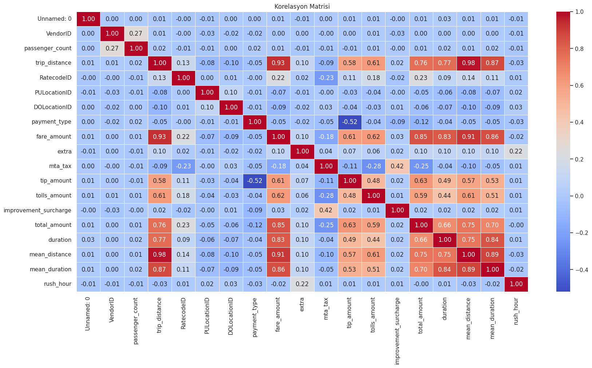
    


```python
df2 = df1.copy()

df2 = df2.drop(['Unnamed: 0', 'tpep_dropoff_datetime', 'tpep_pickup_datetime',
               'trip_distance', 'RatecodeID', 'store_and_fwd_flag', 'PULocationID', 'DOLocationID',
               'payment_type', 'extra', 'mta_tax', 'tip_amount', 'tolls_amount', 'improvement_surcharge',
               'total_amount', 'tpep_dropoff_datetime', 'tpep_pickup_datetime', 'duration',
               'pickup_dropoff', 'day', 'month',"trip_duration"
               ], axis=1)

df2.info()
```

    <class 'pandas.core.frame.DataFrame'>
    RangeIndex: 22699 entries, 0 to 22698
    Data columns (total 6 columns):
     #   Column           Non-Null Count  Dtype  
    ---  ------           --------------  -----  
     0   VendorID         22699 non-null  int64  
     1   passenger_count  22699 non-null  int64  
     2   fare_amount      22699 non-null  float64
     3   mean_distance    22699 non-null  float64
     4   mean_duration    22699 non-null  float64
     5   rush_hour        22699 non-null  int64  
    dtypes: float64(3), int64(3)
    memory usage: 1.0 MB


```python
# Create a pairplot to visualize pairwise relationships between variables in the data
### YOUR CODE HERE ###

sns.pairplot(df2[['fare_amount', 'mean_duration', 'mean_distance']],
             plot_kws={'alpha':0.4, 'size':5},
             );
```


    
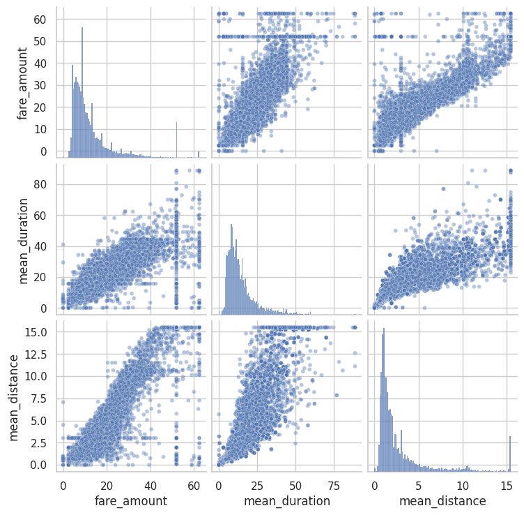
    


```python
df2.corr(method='pearson')
plt.figure(figsize=(6,4))
sns.heatmap(df2.corr(method='pearson'), annot=True, cmap='Reds')
plt.title('Correlation heatmap',
          fontsize=18)
plt.show()
```


    
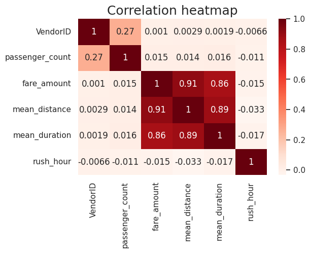
    


## Regresyon başlangıç


```python
# Remove the target column from the features
X = df2.drop(columns=['fare_amount'])

# Set y variable
y = df2[['fare_amount']]

# Display first few rows
X.head()
```


<div>
<style scoped>
    .dataframe tbody tr th:only-of-type {
        vertical-align: middle;
    }

    .dataframe tbody tr th {
        vertical-align: top;
    }

    .dataframe thead th {
        text-align: right;
    }
</style>
<table border="1" class="dataframe">
  <thead>
    <tr style="text-align: right;">
      <th></th>
      <th>VendorID</th>
      <th>passenger_count</th>
      <th>mean_distance</th>
      <th>mean_duration</th>
      <th>rush_hour</th>
    </tr>
  </thead>
  <tbody>
    <tr>
      <th>0</th>
      <td>2</td>
      <td>6</td>
      <td>3.521667</td>
      <td>22.847222</td>
      <td>1</td>
    </tr>
    <tr>
      <th>1</th>
      <td>1</td>
      <td>1</td>
      <td>3.108889</td>
      <td>24.470370</td>
      <td>0</td>
    </tr>
    <tr>
      <th>2</th>
      <td>1</td>
      <td>1</td>
      <td>0.881429</td>
      <td>7.250000</td>
      <td>1</td>
    </tr>
    <tr>
      <th>3</th>
      <td>2</td>
      <td>1</td>
      <td>3.700000</td>
      <td>30.250000</td>
      <td>0</td>
    </tr>
    <tr>
      <th>4</th>
      <td>2</td>
      <td>1</td>
      <td>4.435000</td>
      <td>14.616667</td>
      <td>0</td>
    </tr>
  </tbody>
</table>
</div>


```python
# Convert VendorID to string
X['VendorID'] = X['VendorID'].astype(str)

# Get dummies
X = pd.get_dummies(X, drop_first=True)
X.head()
```


<div>
<style scoped>
    .dataframe tbody tr th:only-of-type {
        vertical-align: middle;
    }

    .dataframe tbody tr th {
        vertical-align: top;
    }

    .dataframe thead th {
        text-align: right;
    }
</style>
<table border="1" class="dataframe">
  <thead>
    <tr style="text-align: right;">
      <th></th>
      <th>passenger_count</th>
      <th>mean_distance</th>
      <th>mean_duration</th>
      <th>rush_hour</th>
      <th>VendorID_2</th>
    </tr>
  </thead>
  <tbody>
    <tr>
      <th>0</th>
      <td>6</td>
      <td>3.521667</td>
      <td>22.847222</td>
      <td>1</td>
      <td>True</td>
    </tr>
    <tr>
      <th>1</th>
      <td>1</td>
      <td>3.108889</td>
      <td>24.470370</td>
      <td>0</td>
      <td>False</td>
    </tr>
    <tr>
      <th>2</th>
      <td>1</td>
      <td>0.881429</td>
      <td>7.250000</td>
      <td>1</td>
      <td>False</td>
    </tr>
    <tr>
      <th>3</th>
      <td>1</td>
      <td>3.700000</td>
      <td>30.250000</td>
      <td>0</td>
      <td>True</td>
    </tr>
    <tr>
      <th>4</th>
      <td>1</td>
      <td>4.435000</td>
      <td>14.616667</td>
      <td>0</td>
      <td>True</td>
    </tr>
  </tbody>
</table>
</div>


```python
# Create training and testing sets

X_train, X_test, y_train, y_test = train_test_split(X, y, test_size=0.2, random_state=0)
```


```python
# Standardize the X variables
scaler = StandardScaler().fit(X_train)
X_train_scaled = scaler.transform(X_train)
print('X_train scaled:', X_train_scaled)
```

    X_train scaled: [[-0.50301524  1.00348588  0.17616665 -0.79008842  0.89286563]
     [-0.50301524 -0.64391805 -0.69829589  1.26568112  0.89286563]
     [ 0.27331093 -0.50735614 -0.57301906 -0.79008842 -1.11998936]
     ...
     [-0.50301524 -0.47699901 -0.6788917  -0.79008842 -1.11998936]
     [-0.50301524 -0.63196235 -0.85743597  1.26568112 -1.11998936]
     [ 1.82596329  0.9667956   1.13212101 -0.79008842  0.89286563]]


```python
# Fit your model to the training data
lr=LinearRegression()
lr.fit(X_train_scaled, y_train)
```


<style>#sk-container-id-1 {color: black;background-color: white;}#sk-container-id-1 pre{padding: 0;}#sk-container-id-1 div.sk-toggleable {background-color: white;}#sk-container-id-1 label.sk-toggleable__label {cursor: pointer;display: block;width: 100%;margin-bottom: 0;padding: 0.3em;box-sizing: border-box;text-align: center;}#sk-container-id-1 label.sk-toggleable__label-arrow:before {content: "▸";float: left;margin-right: 0.25em;color: #696969;}#sk-container-id-1 label.sk-toggleable__label-arrow:hover:before {color: black;}#sk-container-id-1 div.sk-estimator:hover label.sk-toggleable__label-arrow:before {color: black;}#sk-container-id-1 div.sk-toggleable__content {max-height: 0;max-width: 0;overflow: hidden;text-align: left;background-color: #f0f8ff;}#sk-container-id-1 div.sk-toggleable__content pre {margin: 0.2em;color: black;border-radius: 0.25em;background-color: #f0f8ff;}#sk-container-id-1 input.sk-toggleable__control:checked~div.sk-toggleable__content {max-height: 200px;max-width: 100%;overflow: auto;}#sk-container-id-1 input.sk-toggleable__control:checked~label.sk-toggleable__label-arrow:before {content: "▾";}#sk-container-id-1 div.sk-estimator input.sk-toggleable__control:checked~label.sk-toggleable__label {background-color: #d4ebff;}#sk-container-id-1 div.sk-label input.sk-toggleable__control:checked~label.sk-toggleable__label {background-color: #d4ebff;}#sk-container-id-1 input.sk-hidden--visually {border: 0;clip: rect(1px 1px 1px 1px);clip: rect(1px, 1px, 1px, 1px);height: 1px;margin: -1px;overflow: hidden;padding: 0;position: absolute;width: 1px;}#sk-container-id-1 div.sk-estimator {font-family: monospace;background-color: #f0f8ff;border: 1px dotted black;border-radius: 0.25em;box-sizing: border-box;margin-bottom: 0.5em;}#sk-container-id-1 div.sk-estimator:hover {background-color: #d4ebff;}#sk-container-id-1 div.sk-parallel-item::after {content: "";width: 100%;border-bottom: 1px solid gray;flex-grow: 1;}#sk-container-id-1 div.sk-label:hover label.sk-toggleable__label {background-color: #d4ebff;}#sk-container-id-1 div.sk-serial::before {content: "";position: absolute;border-left: 1px solid gray;box-sizing: border-box;top: 0;bottom: 0;left: 50%;z-index: 0;}#sk-container-id-1 div.sk-serial {display: flex;flex-direction: column;align-items: center;background-color: white;padding-right: 0.2em;padding-left: 0.2em;position: relative;}#sk-container-id-1 div.sk-item {position: relative;z-index: 1;}#sk-container-id-1 div.sk-parallel {display: flex;align-items: stretch;justify-content: center;background-color: white;position: relative;}#sk-container-id-1 div.sk-item::before, #sk-container-id-1 div.sk-parallel-item::before {content: "";position: absolute;border-left: 1px solid gray;box-sizing: border-box;top: 0;bottom: 0;left: 50%;z-index: -1;}#sk-container-id-1 div.sk-parallel-item {display: flex;flex-direction: column;z-index: 1;position: relative;background-color: white;}#sk-container-id-1 div.sk-parallel-item:first-child::after {align-self: flex-end;width: 50%;}#sk-container-id-1 div.sk-parallel-item:last-child::after {align-self: flex-start;width: 50%;}#sk-container-id-1 div.sk-parallel-item:only-child::after {width: 0;}#sk-container-id-1 div.sk-dashed-wrapped {border: 1px dashed gray;margin: 0 0.4em 0.5em 0.4em;box-sizing: border-box;padding-bottom: 0.4em;background-color: white;}#sk-container-id-1 div.sk-label label {font-family: monospace;font-weight: bold;display: inline-block;line-height: 1.2em;}#sk-container-id-1 div.sk-label-container {text-align: center;}#sk-container-id-1 div.sk-container {/* jupyter's `normalize.less` sets `[hidden] { display: none; }` but bootstrap.min.css set `[hidden] { display: none !important; }` so we also need the `!important` here to be able to override the default hidden behavior on the sphinx rendered scikit-learn.org. See: https://github.com/scikit-learn/scikit-learn/issues/21755 */display: inline-block !important;position: relative;}#sk-container-id-1 div.sk-text-repr-fallback {display: none;}</style><div id="sk-container-id-1" class="sk-top-container"><div class="sk-text-repr-fallback"><pre>LinearRegression()</pre><b>In a Jupyter environment, please rerun this cell to show the HTML representation or trust the notebook. <br />On GitHub, the HTML representation is unable to render, please try loading this page with nbviewer.org.</b></div><div class="sk-container" hidden><div class="sk-item"><div class="sk-estimator sk-toggleable"><input class="sk-toggleable__control sk-hidden--visually" id="sk-estimator-id-1" type="checkbox" checked><label for="sk-estimator-id-1" class="sk-toggleable__label sk-toggleable__label-arrow">LinearRegression</label><div class="sk-toggleable__content"><pre>LinearRegression()</pre></div></div></div></div></div>


```python
# Evaluate the model performance on the training data
r_sq = lr.score(X_train_scaled, y_train)
print('Coefficient of determination:', r_sq)
y_pred_train = lr.predict(X_train_scaled)
print('R^2:', r2_score(y_train, y_pred_train))
print('MAE:', mean_absolute_error(y_train, y_pred_train))
print('MSE:', mean_squared_error(y_train, y_pred_train))
print('RMSE:',np.sqrt(mean_squared_error(y_train, y_pred_train)))
```

    Coefficient of determination: 0.8397960695843478
    R^2: 0.8397960695843478
    MAE: 2.1995034728415437
    MSE: 17.895026379038665
    RMSE: 4.23025133757306


## Test sonuçları


```python
# Scale the X_test data
X_test_scaled = scaler.transform(X_test)
```


```python
# Evaluate the model performance on the testing data
r_sq_test = lr.score(X_test_scaled, y_test)
print('Coefficient of determination:', r_sq_test)
y_pred_test = lr.predict(X_test_scaled)
print('R^2:', r2_score(y_test, y_pred_test))
print('MAE:', mean_absolute_error(y_test,y_pred_test))
print('MSE:', mean_squared_error(y_test, y_pred_test))
print('RMSE:',np.sqrt(mean_squared_error(y_test, y_pred_test)))
```

    Coefficient of determination: 0.8723364196860601
    R^2: 0.8723364196860601
    MAE: 2.1215647086087834
    MSE: 13.882979511341716
    RMSE: 3.7259870519557254


```python
# Create a `results` dataframe
results = pd.DataFrame(data={'actual': y_test['fare_amount'],
                             'predicted': y_pred_test.ravel()})
results['residual'] = results['actual'] - results['predicted']

```


```python
results.head(10)

```


<div>
<style scoped>
    .dataframe tbody tr th:only-of-type {
        vertical-align: middle;
    }

    .dataframe tbody tr th {
        vertical-align: top;
    }

    .dataframe thead th {
        text-align: right;
    }
</style>
<table border="1" class="dataframe">
  <thead>
    <tr style="text-align: right;">
      <th></th>
      <th>actual</th>
      <th>predicted</th>
      <th>residual</th>
    </tr>
  </thead>
  <tbody>
    <tr>
      <th>5818</th>
      <td>14.0</td>
      <td>12.608296</td>
      <td>1.391704</td>
    </tr>
    <tr>
      <th>18134</th>
      <td>28.0</td>
      <td>16.433088</td>
      <td>11.566912</td>
    </tr>
    <tr>
      <th>4655</th>
      <td>5.5</td>
      <td>6.508014</td>
      <td>-1.008014</td>
    </tr>
    <tr>
      <th>7378</th>
      <td>15.5</td>
      <td>16.987395</td>
      <td>-1.487395</td>
    </tr>
    <tr>
      <th>13914</th>
      <td>9.5</td>
      <td>10.444091</td>
      <td>-0.944091</td>
    </tr>
    <tr>
      <th>308</th>
      <td>23.5</td>
      <td>21.672202</td>
      <td>1.827798</td>
    </tr>
    <tr>
      <th>3061</th>
      <td>39.5</td>
      <td>38.666027</td>
      <td>0.833973</td>
    </tr>
    <tr>
      <th>12401</th>
      <td>57.5</td>
      <td>41.166817</td>
      <td>16.333183</td>
    </tr>
    <tr>
      <th>5662</th>
      <td>24.5</td>
      <td>23.979781</td>
      <td>0.520219</td>
    </tr>
    <tr>
      <th>21767</th>
      <td>8.0</td>
      <td>8.545855</td>
      <td>-0.545855</td>
    </tr>
  </tbody>
</table>
</div>


### Model sonucunu görselleştireim


```python
# Create a scatterplot to visualize `predicted` over `actual`
fig, ax = plt.subplots(figsize=(6, 6))
sns.set(style='whitegrid')
sns.scatterplot(x='actual',
                y='predicted',
                data=results,
                s=20,
                alpha=0.5,
                ax=ax
)
# Draw an x=y line to show what the results would be if the model were perfect
plt.plot([0,60], [0,60], c='red', linewidth=2)
plt.title('Actual vs. predicted');
```


    
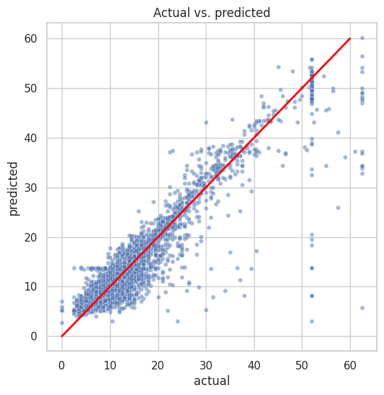
    


#### Residuals
Residuals (hatalar, artıklar), bir regresyon modelinde tahmin edilen değer ile gerçek değer arasındaki farktır.

Matematiksel olarak şu şekilde ifade edilir:

\text{Residual} = \text{Gerçek Değer} - \text{Tahmin Edilen Değer}


🔹 Başka bir deyişle: Modelin yaptığı hatayı ölçer.
🔹 Eğer residual değeri sıfıra yakınsa, model tahminleri doğru yapıyor demektir.
🔹 Eğer residual değeri büyükse, model tahminlerinde hata yapıyor demektir.


```python
# Visualize the distribution of the `residuals`
sns.histplot(results['residual'], bins=np.arange(-15,15.5,0.5))
plt.title('Distribution of the residuals')
plt.xlabel('residual value')
plt.ylabel('count');
```


    
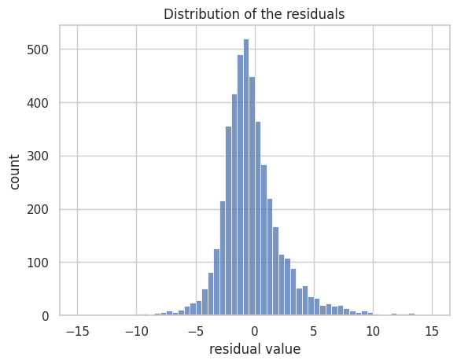
    


#### Actual vs Predicted values 

Bu grafik, tahmin edilen (predicted) değerler ile residual (hata) değerleri arasındaki ilişkiyi görselleştirmek için kullanılır. Residual plot, bir regresyon modelinin doğruluğunu ve uygunluğunu değerlendirmenin en yaygın yollarından biridir.


```python
# Create a scatterplot of `residuals` over `predicted`

sns.scatterplot(x='predicted', y='residual', data=results)
plt.axhline(0, c='red')
plt.title('Scatterplot of residuals over predicted values')
plt.xlabel('predicted value')
plt.ylabel('residual value')
plt.show()
```


    
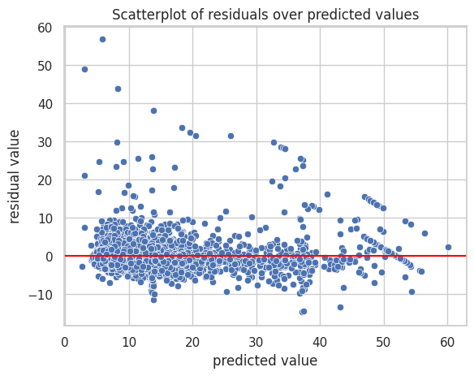
    


#### coefficients inceleyelim 
Katsayılar (Coefficients), regresyon modellerinde bağımsız değişkenlerin (features) bağımlı değişken (target) üzerindeki etkisini gösterir.
✔ Katsayılar bağımsız değişkenlerin Y üzerindeki etkisini gösterir.
✔ Pozitif katsayılar → O değişken arttıkça Y de artar.
✔ Negatif katsayılar → O değişken arttıkça Y azalır.


```python
# Get model coefficients
coefficients = pd.DataFrame(lr.coef_, columns=X.columns)
coefficients
```


<div>
<style scoped>
    .dataframe tbody tr th:only-of-type {
        vertical-align: middle;
    }

    .dataframe tbody tr th {
        vertical-align: top;
    }

    .dataframe thead th {
        text-align: right;
    }
</style>
<table border="1" class="dataframe">
  <thead>
    <tr style="text-align: right;">
      <th></th>
      <th>passenger_count</th>
      <th>mean_distance</th>
      <th>mean_duration</th>
      <th>rush_hour</th>
      <th>VendorID_2</th>
    </tr>
  </thead>
  <tbody>
    <tr>
      <th>0</th>
      <td>0.01637</td>
      <td>7.468821</td>
      <td>2.430816</td>
      <td>0.113395</td>
      <td>-0.031631</td>
    </tr>
  </tbody>
</table>
</div>


Bu örneğe göre mean_distance asıl etkili olan değişken sonrasında ise mean_duration geliyor diyebiliriz katsayılara bakarak


```python
X_scaled = scaler.transform(X)
y_preds_full = lr.predict(X_scaled)
```


```python
# Create a new df containing just the RatecodeID col from the whole dataset
final_preds = df1[['RatecodeID']].copy()

# Add a column containing all the predictions
final_preds['y_preds_full'] = y_preds_full

# Impute a prediction of 52 at all rows where RatecodeID == 2
final_preds.loc[final_preds['RatecodeID']==2, 'y_preds_full'] = 52

# Check that it worked
final_preds[final_preds['RatecodeID']==2].head()
```


<div>
<style scoped>
    .dataframe tbody tr th:only-of-type {
        vertical-align: middle;
    }

    .dataframe tbody tr th {
        vertical-align: top;
    }

    .dataframe thead th {
        text-align: right;
    }
</style>
<table border="1" class="dataframe">
  <thead>
    <tr style="text-align: right;">
      <th></th>
      <th>RatecodeID</th>
      <th>y_preds_full</th>
    </tr>
  </thead>
  <tbody>
    <tr>
      <th>11</th>
      <td>2</td>
      <td>52.0</td>
    </tr>
    <tr>
      <th>110</th>
      <td>2</td>
      <td>52.0</td>
    </tr>
    <tr>
      <th>161</th>
      <td>2</td>
      <td>52.0</td>
    </tr>
    <tr>
      <th>247</th>
      <td>2</td>
      <td>52.0</td>
    </tr>
    <tr>
      <th>379</th>
      <td>2</td>
      <td>52.0</td>
    </tr>
  </tbody>
</table>
</div>


```python
final_preds = final_preds['y_preds_full']
print('R^2:', r2_score(y, final_preds))
print('MAE:', mean_absolute_error(y, final_preds))
print('MSE:', mean_squared_error(y, final_preds))
print('RMSE:',np.sqrt(mean_squared_error(y, final_preds)))
```

    R^2: 0.8892988738305739
    MAE: 2.0320711323966982
    MSE: 12.300077405367519
    RMSE: 3.507146618744007


```python
# Combine means columns with predictions column
nyc_preds_means = df1[['mean_duration', 'mean_distance']].copy()
nyc_preds_means['predicted_fare'] = final_preds

nyc_preds_means.head()
```


<div>
<style scoped>
    .dataframe tbody tr th:only-of-type {
        vertical-align: middle;
    }

    .dataframe tbody tr th {
        vertical-align: top;
    }

    .dataframe thead th {
        text-align: right;
    }
</style>
<table border="1" class="dataframe">
  <thead>
    <tr style="text-align: right;">
      <th></th>
      <th>mean_duration</th>
      <th>mean_distance</th>
      <th>predicted_fare</th>
    </tr>
  </thead>
  <tbody>
    <tr>
      <th>0</th>
      <td>22.847222</td>
      <td>3.521667</td>
      <td>16.729745</td>
    </tr>
    <tr>
      <th>1</th>
      <td>24.470370</td>
      <td>3.108889</td>
      <td>15.920621</td>
    </tr>
    <tr>
      <th>2</th>
      <td>7.250000</td>
      <td>0.881429</td>
      <td>6.792090</td>
    </tr>
    <tr>
      <th>3</th>
      <td>30.250000</td>
      <td>3.700000</td>
      <td>18.632462</td>
    </tr>
    <tr>
      <th>4</th>
      <td>14.616667</td>
      <td>4.435000</td>
      <td>16.591348</td>
    </tr>
  </tbody>
</table>
</div>


🔹 Burada yapılan hata:
	•	mean_distance ve mean_duration sütunları tüm veri üzerinden hesaplandı, yani test verisi de dahil edildi.
	•	Ancak bu sütunlar modelin girdi (feature) değişkenleri olarak kullanıldı.
	•	Yani model, test setinde yer alan bazı bilgileri zaten öğrenmiş oldu ve test performansı gerçekte olduğundan daha iyi çıktı.

🔹 Bunun sonucu:
	•	R² skoru aslında olması gerekenden ~0.03 daha yüksek çıktı.
	•	Model, gerçek dünyada bu kadar iyi çalışmayabilir.

🔹 Doğru yöntem:
✔ Bu sütunlar yalnızca eğitim seti üzerinden hesaplanmalıydı.
✔ Test setine aktarılırken, yalnızca eğitim setinde hesaplanan değerler kullanılmalıydı.
✔ Ancak bu, test setinde bazı eksik (NaN) değerlerin oluşmasına sebep olabilir, bu da ayrı bir şekilde ele alınmalıdır.

📌 SONUÇ
	1.	Veri kaçağına dikkat et: Test verisini yanlışlıkla eğitim sürecine dahil etme.
	2.	Eksik verileri model eğitmeden önce doldur: Sonradan doldurup modeli tekrar test etmek yanlış sonuç verebilir.
	3.	Gerçek projelerde veri akışı otomatik hale getirilir: Büyük projelerde her adımı manuel yapmak yerine makine öğrenmesi pipeline’ları kullanılır.

# Görev 4 ML
In this activity, you will practice using tree-based modeling techniques to predict on a binary target class.

The purpose of this model is to find ways to generate more revenue for taxi cab drivers.

The goal of this model is to predict whether or not a customer is a generous tipper.

## Feature Engineering 
### tip_percent 


```python
# Cömert bahşiş bırakanları bulalım
df1['tip_percent'] = round(df1['tip_amount'] / (df1['total_amount'] - df1['tip_amount']), 3)
df1['tip_percent'].head(10)
```


    0    0.200
    1    0.238
    2    0.199
    3    0.300
    4    0.000
    5    0.200
    6    0.200
    7    0.100
    8    0.000
    9    0.199
    Name: tip_percent, dtype: float64


```python
df1['tip_percent'] = df1['tip_percent'].fillna(0)  # Eksik değerleri 0 olarak doldur

df1['generous'] = (df1['tip_percent'] >= 0.2).astype(int)  # Boolean'ı integer'a çevir
```


```python
# Create 'generous' col (target)
# Bu kişilerin cömert olup olmadığını kategori edelim %20 üstü verenler cömerttir
df1['generous'] = df1['tip_percent']
df1['generous'] = (df1['generous'] >= 0.2)
df1['generous'] = df1['generous'].astype(int)
```

### Rush hours 


```python
# Create 'am_rush' col
df1['am_rush'] = df1['tpep_pickup_datetime'].dt.hour

# Create 'daytime' col
df1['daytime'] = df1['tpep_pickup_datetime'].dt.hour

# Create 'pm_rush' col
df1['pm_rush'] = df1['tpep_pickup_datetime'].dt.hour

# Create 'nighttime' col
df1['nighttime'] = df1['tpep_pickup_datetime'].dt.hour

# Define 'am_rush()' conversion function [06:00–10:00)
def am_rush(hour):
    if 6 <= hour['am_rush'] < 10:
        val = 1
    else:
        val = 0
    return val
    
# Apply 'am_rush' function to the 'am_rush' series
df1['am_rush'] = df1.apply(am_rush, axis=1)
df1['am_rush'].head()
```


    0    1
    1    0
    2    1
    3    0
    4    0
    Name: am_rush, dtype: int64


```python
# Define 'daytime()' conversion function [10:00–16:00)
def daytime(hour):
    if 10 <= hour['daytime'] < 16:
        val = 1
    else:
        val = 0
    return val

# Apply 'daytime' function to the 'daytime' series
df1['daytime'] = df1.apply(daytime, axis=1)
```


```python
# Define 'pm_rush()' conversion function [16:00–20:00)
def pm_rush(hour):
    if 16 <= hour['pm_rush'] < 20:
        val = 1
    else:
        val = 0
    return val

# Apply 'pm_rush' function to the 'pm_rush' series
df1['pm_rush'] = df1.apply(pm_rush, axis=1)
```


```python
# Define 'nighttime()' conversion function [20:00–06:00)
def nighttime(hour):
    if 20 <= hour['nighttime'] < 24:
        val = 1
    elif 0 <= hour['nighttime'] < 6:
        val = 1
    else:
        val = 0
    return val

# Apply 'nighttime' function to the 'nighttime' series
df1['nighttime'] = df1.apply(nighttime, axis=1)
```


```python
df1["payment_type"].value_counts()
```


    payment_type
    1    15265
    2     7267
    3      121
    4       46
    Name: count, dtype: int64


Ücreti nakit verenlerin tip miktarı belki sisteme girilmemiş olabilir bu da veride dengesizlik oluşturabilir bunu bi inceleyyelim 


```python
credid_card_customer = df1[df1["payment_type"] == 1]
cash_customer = df1[df1["payment_type"] == 2]


```


```python
credid_card_customer
```


<div>
<style scoped>
    .dataframe tbody tr th:only-of-type {
        vertical-align: middle;
    }

    .dataframe tbody tr th {
        vertical-align: top;
    }

    .dataframe thead th {
        text-align: right;
    }
</style>
<table border="1" class="dataframe">
  <thead>
    <tr style="text-align: right;">
      <th></th>
      <th>Unnamed: 0</th>
      <th>VendorID</th>
      <th>tpep_pickup_datetime</th>
      <th>tpep_dropoff_datetime</th>
      <th>passenger_count</th>
      <th>trip_distance</th>
      <th>RatecodeID</th>
      <th>store_and_fwd_flag</th>
      <th>PULocationID</th>
      <th>DOLocationID</th>
      <th>payment_type</th>
      <th>fare_amount</th>
      <th>extra</th>
      <th>mta_tax</th>
      <th>tip_amount</th>
      <th>tolls_amount</th>
      <th>improvement_surcharge</th>
      <th>total_amount</th>
      <th>month</th>
      <th>day</th>
      <th>trip_duration</th>
      <th>duration</th>
      <th>pickup_dropoff</th>
      <th>mean_distance</th>
      <th>mean_duration</th>
      <th>rush_hour</th>
      <th>tip_percent</th>
      <th>generous</th>
      <th>am_rush</th>
      <th>daytime</th>
      <th>pm_rush</th>
      <th>nighttime</th>
    </tr>
  </thead>
  <tbody>
    <tr>
      <th>0</th>
      <td>24870114</td>
      <td>2</td>
      <td>2017-03-25 08:55:43</td>
      <td>2017-03-25 09:09:47</td>
      <td>6</td>
      <td>3.34</td>
      <td>1</td>
      <td>N</td>
      <td>100</td>
      <td>231</td>
      <td>1</td>
      <td>13.0</td>
      <td>0.0</td>
      <td>0.5</td>
      <td>2.76</td>
      <td>0.00</td>
      <td>0.3</td>
      <td>16.56</td>
      <td>March</td>
      <td>Saturday</td>
      <td>0 days 00:14:04</td>
      <td>14.066667</td>
      <td>100 231</td>
      <td>3.521667</td>
      <td>22.847222</td>
      <td>1</td>
      <td>0.200</td>
      <td>1</td>
      <td>1</td>
      <td>0</td>
      <td>0</td>
      <td>0</td>
    </tr>
    <tr>
      <th>1</th>
      <td>35634249</td>
      <td>1</td>
      <td>2017-04-11 14:53:28</td>
      <td>2017-04-11 15:19:58</td>
      <td>1</td>
      <td>1.80</td>
      <td>1</td>
      <td>N</td>
      <td>186</td>
      <td>43</td>
      <td>1</td>
      <td>16.0</td>
      <td>0.0</td>
      <td>0.5</td>
      <td>4.00</td>
      <td>0.00</td>
      <td>0.3</td>
      <td>20.80</td>
      <td>April</td>
      <td>Tuesday</td>
      <td>0 days 00:26:30</td>
      <td>26.500000</td>
      <td>186 43</td>
      <td>3.108889</td>
      <td>24.470370</td>
      <td>0</td>
      <td>0.238</td>
      <td>1</td>
      <td>0</td>
      <td>1</td>
      <td>0</td>
      <td>0</td>
    </tr>
    <tr>
      <th>2</th>
      <td>106203690</td>
      <td>1</td>
      <td>2017-12-15 07:26:56</td>
      <td>2017-12-15 07:34:08</td>
      <td>1</td>
      <td>1.00</td>
      <td>1</td>
      <td>N</td>
      <td>262</td>
      <td>236</td>
      <td>1</td>
      <td>6.5</td>
      <td>0.0</td>
      <td>0.5</td>
      <td>1.45</td>
      <td>0.00</td>
      <td>0.3</td>
      <td>8.75</td>
      <td>December</td>
      <td>Friday</td>
      <td>0 days 00:07:12</td>
      <td>7.200000</td>
      <td>262 236</td>
      <td>0.881429</td>
      <td>7.250000</td>
      <td>1</td>
      <td>0.199</td>
      <td>0</td>
      <td>1</td>
      <td>0</td>
      <td>0</td>
      <td>0</td>
    </tr>
    <tr>
      <th>3</th>
      <td>38942136</td>
      <td>2</td>
      <td>2017-05-07 13:17:59</td>
      <td>2017-05-07 13:48:14</td>
      <td>1</td>
      <td>3.70</td>
      <td>1</td>
      <td>N</td>
      <td>188</td>
      <td>97</td>
      <td>1</td>
      <td>20.5</td>
      <td>0.0</td>
      <td>0.5</td>
      <td>6.39</td>
      <td>0.00</td>
      <td>0.3</td>
      <td>27.69</td>
      <td>May</td>
      <td>Sunday</td>
      <td>0 days 00:30:15</td>
      <td>30.250000</td>
      <td>188 97</td>
      <td>3.700000</td>
      <td>30.250000</td>
      <td>0</td>
      <td>0.300</td>
      <td>1</td>
      <td>0</td>
      <td>1</td>
      <td>0</td>
      <td>0</td>
    </tr>
    <tr>
      <th>5</th>
      <td>23345809</td>
      <td>2</td>
      <td>2017-03-25 20:34:11</td>
      <td>2017-03-25 20:42:11</td>
      <td>6</td>
      <td>2.30</td>
      <td>1</td>
      <td>N</td>
      <td>161</td>
      <td>236</td>
      <td>1</td>
      <td>9.0</td>
      <td>0.5</td>
      <td>0.5</td>
      <td>2.06</td>
      <td>0.00</td>
      <td>0.3</td>
      <td>12.36</td>
      <td>March</td>
      <td>Saturday</td>
      <td>0 days 00:08:00</td>
      <td>8.000000</td>
      <td>161 236</td>
      <td>2.052258</td>
      <td>11.855376</td>
      <td>0</td>
      <td>0.200</td>
      <td>1</td>
      <td>0</td>
      <td>0</td>
      <td>0</td>
      <td>1</td>
    </tr>
    <tr>
      <th>...</th>
      <td>...</td>
      <td>...</td>
      <td>...</td>
      <td>...</td>
      <td>...</td>
      <td>...</td>
      <td>...</td>
      <td>...</td>
      <td>...</td>
      <td>...</td>
      <td>...</td>
      <td>...</td>
      <td>...</td>
      <td>...</td>
      <td>...</td>
      <td>...</td>
      <td>...</td>
      <td>...</td>
      <td>...</td>
      <td>...</td>
      <td>...</td>
      <td>...</td>
      <td>...</td>
      <td>...</td>
      <td>...</td>
      <td>...</td>
      <td>...</td>
      <td>...</td>
      <td>...</td>
      <td>...</td>
      <td>...</td>
      <td>...</td>
    </tr>
    <tr>
      <th>22692</th>
      <td>60425673</td>
      <td>1</td>
      <td>2017-07-16 03:22:51</td>
      <td>2017-07-16 03:40:52</td>
      <td>1</td>
      <td>5.70</td>
      <td>1</td>
      <td>N</td>
      <td>249</td>
      <td>17</td>
      <td>1</td>
      <td>19.0</td>
      <td>0.5</td>
      <td>0.5</td>
      <td>4.05</td>
      <td>0.00</td>
      <td>0.3</td>
      <td>24.35</td>
      <td>July</td>
      <td>Sunday</td>
      <td>0 days 00:18:01</td>
      <td>18.016667</td>
      <td>249 17</td>
      <td>5.700000</td>
      <td>18.016667</td>
      <td>0</td>
      <td>0.200</td>
      <td>1</td>
      <td>0</td>
      <td>0</td>
      <td>0</td>
      <td>1</td>
    </tr>
    <tr>
      <th>22693</th>
      <td>67858616</td>
      <td>2</td>
      <td>2017-08-10 22:20:04</td>
      <td>2017-08-10 22:29:31</td>
      <td>1</td>
      <td>0.89</td>
      <td>1</td>
      <td>N</td>
      <td>229</td>
      <td>170</td>
      <td>1</td>
      <td>7.5</td>
      <td>0.5</td>
      <td>0.5</td>
      <td>1.76</td>
      <td>0.00</td>
      <td>0.3</td>
      <td>10.56</td>
      <td>August</td>
      <td>Thursday</td>
      <td>0 days 00:09:27</td>
      <td>9.450000</td>
      <td>229 170</td>
      <td>1.062778</td>
      <td>8.095370</td>
      <td>0</td>
      <td>0.200</td>
      <td>1</td>
      <td>0</td>
      <td>0</td>
      <td>0</td>
      <td>1</td>
    </tr>
    <tr>
      <th>22695</th>
      <td>66632549</td>
      <td>2</td>
      <td>2017-08-06 16:43:59</td>
      <td>2017-08-06 17:24:47</td>
      <td>1</td>
      <td>15.48</td>
      <td>2</td>
      <td>N</td>
      <td>132</td>
      <td>164</td>
      <td>1</td>
      <td>52.0</td>
      <td>0.0</td>
      <td>0.5</td>
      <td>14.64</td>
      <td>5.76</td>
      <td>0.3</td>
      <td>73.20</td>
      <td>August</td>
      <td>Sunday</td>
      <td>0 days 00:40:48</td>
      <td>40.800000</td>
      <td>132 164</td>
      <td>15.480000</td>
      <td>59.560417</td>
      <td>1</td>
      <td>0.250</td>
      <td>1</td>
      <td>0</td>
      <td>0</td>
      <td>1</td>
      <td>0</td>
    </tr>
    <tr>
      <th>22697</th>
      <td>60217333</td>
      <td>2</td>
      <td>2017-07-15 12:56:30</td>
      <td>2017-07-15 13:08:26</td>
      <td>1</td>
      <td>2.36</td>
      <td>1</td>
      <td>N</td>
      <td>68</td>
      <td>144</td>
      <td>1</td>
      <td>10.5</td>
      <td>0.0</td>
      <td>0.5</td>
      <td>1.70</td>
      <td>0.00</td>
      <td>0.3</td>
      <td>13.00</td>
      <td>July</td>
      <td>Saturday</td>
      <td>0 days 00:11:56</td>
      <td>11.933333</td>
      <td>68 144</td>
      <td>2.077500</td>
      <td>16.650000</td>
      <td>0</td>
      <td>0.150</td>
      <td>0</td>
      <td>0</td>
      <td>1</td>
      <td>0</td>
      <td>0</td>
    </tr>
    <tr>
      <th>22698</th>
      <td>17208911</td>
      <td>1</td>
      <td>2017-03-02 13:02:49</td>
      <td>2017-03-02 13:16:09</td>
      <td>1</td>
      <td>2.10</td>
      <td>1</td>
      <td>N</td>
      <td>239</td>
      <td>236</td>
      <td>1</td>
      <td>11.0</td>
      <td>0.0</td>
      <td>0.5</td>
      <td>2.35</td>
      <td>0.00</td>
      <td>0.3</td>
      <td>14.15</td>
      <td>March</td>
      <td>Thursday</td>
      <td>0 days 00:13:20</td>
      <td>13.333333</td>
      <td>239 236</td>
      <td>1.476970</td>
      <td>9.405556</td>
      <td>0</td>
      <td>0.199</td>
      <td>0</td>
      <td>0</td>
      <td>1</td>
      <td>0</td>
      <td>0</td>
    </tr>
  </tbody>
</table>
<p>15265 rows × 32 columns</p>
</div>


```python
cash_customer
```


<div>
<style scoped>
    .dataframe tbody tr th:only-of-type {
        vertical-align: middle;
    }

    .dataframe tbody tr th {
        vertical-align: top;
    }

    .dataframe thead th {
        text-align: right;
    }
</style>
<table border="1" class="dataframe">
  <thead>
    <tr style="text-align: right;">
      <th></th>
      <th>Unnamed: 0</th>
      <th>VendorID</th>
      <th>tpep_pickup_datetime</th>
      <th>tpep_dropoff_datetime</th>
      <th>passenger_count</th>
      <th>trip_distance</th>
      <th>RatecodeID</th>
      <th>store_and_fwd_flag</th>
      <th>PULocationID</th>
      <th>DOLocationID</th>
      <th>payment_type</th>
      <th>fare_amount</th>
      <th>extra</th>
      <th>mta_tax</th>
      <th>tip_amount</th>
      <th>tolls_amount</th>
      <th>improvement_surcharge</th>
      <th>total_amount</th>
      <th>month</th>
      <th>day</th>
      <th>trip_duration</th>
      <th>duration</th>
      <th>pickup_dropoff</th>
      <th>mean_distance</th>
      <th>mean_duration</th>
      <th>rush_hour</th>
      <th>tip_percent</th>
      <th>generous</th>
      <th>am_rush</th>
      <th>daytime</th>
      <th>pm_rush</th>
      <th>nighttime</th>
    </tr>
  </thead>
  <tbody>
    <tr>
      <th>4</th>
      <td>30841670</td>
      <td>2</td>
      <td>2017-04-15 23:32:20</td>
      <td>2017-04-15 23:49:03</td>
      <td>1</td>
      <td>4.37</td>
      <td>1</td>
      <td>N</td>
      <td>4</td>
      <td>112</td>
      <td>2</td>
      <td>16.5</td>
      <td>0.5</td>
      <td>0.5</td>
      <td>0.0</td>
      <td>0.0</td>
      <td>0.3</td>
      <td>17.8</td>
      <td>April</td>
      <td>Saturday</td>
      <td>0 days 00:16:43</td>
      <td>16.716667</td>
      <td>4 112</td>
      <td>4.435000</td>
      <td>14.616667</td>
      <td>0</td>
      <td>0.0</td>
      <td>0</td>
      <td>0</td>
      <td>0</td>
      <td>0</td>
      <td>1</td>
    </tr>
    <tr>
      <th>8</th>
      <td>8433159</td>
      <td>2</td>
      <td>2017-02-04 16:17:07</td>
      <td>2017-02-04 16:29:14</td>
      <td>1</td>
      <td>1.20</td>
      <td>1</td>
      <td>N</td>
      <td>234</td>
      <td>249</td>
      <td>2</td>
      <td>9.0</td>
      <td>0.0</td>
      <td>0.5</td>
      <td>0.0</td>
      <td>0.0</td>
      <td>0.3</td>
      <td>9.8</td>
      <td>February</td>
      <td>Saturday</td>
      <td>0 days 00:12:07</td>
      <td>12.116667</td>
      <td>234 249</td>
      <td>1.019259</td>
      <td>7.873457</td>
      <td>1</td>
      <td>0.0</td>
      <td>0</td>
      <td>0</td>
      <td>0</td>
      <td>1</td>
      <td>0</td>
    </tr>
    <tr>
      <th>18</th>
      <td>35388828</td>
      <td>2</td>
      <td>2017-04-10 18:12:58</td>
      <td>2017-04-10 18:17:39</td>
      <td>2</td>
      <td>0.63</td>
      <td>1</td>
      <td>N</td>
      <td>263</td>
      <td>262</td>
      <td>2</td>
      <td>5.0</td>
      <td>1.0</td>
      <td>0.5</td>
      <td>0.0</td>
      <td>0.0</td>
      <td>0.3</td>
      <td>6.8</td>
      <td>April</td>
      <td>Monday</td>
      <td>0 days 00:04:41</td>
      <td>4.683333</td>
      <td>263 262</td>
      <td>0.662143</td>
      <td>4.577381</td>
      <td>1</td>
      <td>0.0</td>
      <td>0</td>
      <td>0</td>
      <td>0</td>
      <td>1</td>
      <td>0</td>
    </tr>
    <tr>
      <th>20</th>
      <td>110690689</td>
      <td>1</td>
      <td>2017-12-30 23:52:44</td>
      <td>2017-12-30 23:58:57</td>
      <td>1</td>
      <td>1.10</td>
      <td>1</td>
      <td>N</td>
      <td>166</td>
      <td>238</td>
      <td>2</td>
      <td>6.5</td>
      <td>0.5</td>
      <td>0.5</td>
      <td>0.0</td>
      <td>0.0</td>
      <td>0.3</td>
      <td>7.8</td>
      <td>December</td>
      <td>Saturday</td>
      <td>0 days 00:06:13</td>
      <td>6.216667</td>
      <td>166 238</td>
      <td>1.303333</td>
      <td>6.997778</td>
      <td>0</td>
      <td>0.0</td>
      <td>0</td>
      <td>0</td>
      <td>0</td>
      <td>0</td>
      <td>1</td>
    </tr>
    <tr>
      <th>27</th>
      <td>99525452</td>
      <td>2</td>
      <td>2017-11-24 10:48:13</td>
      <td>2017-11-24 10:52:57</td>
      <td>1</td>
      <td>0.85</td>
      <td>1</td>
      <td>N</td>
      <td>237</td>
      <td>161</td>
      <td>2</td>
      <td>5.5</td>
      <td>0.0</td>
      <td>0.5</td>
      <td>0.0</td>
      <td>0.0</td>
      <td>0.3</td>
      <td>6.3</td>
      <td>November</td>
      <td>Friday</td>
      <td>0 days 00:04:44</td>
      <td>4.733333</td>
      <td>237 161</td>
      <td>0.992295</td>
      <td>10.048087</td>
      <td>0</td>
      <td>0.0</td>
      <td>0</td>
      <td>0</td>
      <td>1</td>
      <td>0</td>
      <td>0</td>
    </tr>
    <tr>
      <th>...</th>
      <td>...</td>
      <td>...</td>
      <td>...</td>
      <td>...</td>
      <td>...</td>
      <td>...</td>
      <td>...</td>
      <td>...</td>
      <td>...</td>
      <td>...</td>
      <td>...</td>
      <td>...</td>
      <td>...</td>
      <td>...</td>
      <td>...</td>
      <td>...</td>
      <td>...</td>
      <td>...</td>
      <td>...</td>
      <td>...</td>
      <td>...</td>
      <td>...</td>
      <td>...</td>
      <td>...</td>
      <td>...</td>
      <td>...</td>
      <td>...</td>
      <td>...</td>
      <td>...</td>
      <td>...</td>
      <td>...</td>
      <td>...</td>
    </tr>
    <tr>
      <th>22673</th>
      <td>58511484</td>
      <td>1</td>
      <td>2017-07-09 17:25:16</td>
      <td>2017-07-09 17:29:16</td>
      <td>1</td>
      <td>0.80</td>
      <td>1</td>
      <td>N</td>
      <td>79</td>
      <td>4</td>
      <td>2</td>
      <td>5.0</td>
      <td>0.0</td>
      <td>0.5</td>
      <td>0.0</td>
      <td>0.0</td>
      <td>0.3</td>
      <td>5.8</td>
      <td>July</td>
      <td>Sunday</td>
      <td>0 days 00:04:00</td>
      <td>4.000000</td>
      <td>79 4</td>
      <td>0.885294</td>
      <td>5.754902</td>
      <td>1</td>
      <td>0.0</td>
      <td>0</td>
      <td>0</td>
      <td>0</td>
      <td>1</td>
      <td>0</td>
    </tr>
    <tr>
      <th>22675</th>
      <td>58407519</td>
      <td>1</td>
      <td>2017-07-09 09:09:10</td>
      <td>2017-07-09 09:15:31</td>
      <td>1</td>
      <td>1.70</td>
      <td>1</td>
      <td>N</td>
      <td>148</td>
      <td>137</td>
      <td>2</td>
      <td>7.5</td>
      <td>0.0</td>
      <td>0.5</td>
      <td>0.0</td>
      <td>0.0</td>
      <td>0.3</td>
      <td>8.3</td>
      <td>July</td>
      <td>Sunday</td>
      <td>0 days 00:06:21</td>
      <td>6.350000</td>
      <td>148 137</td>
      <td>1.902000</td>
      <td>9.343333</td>
      <td>1</td>
      <td>0.0</td>
      <td>0</td>
      <td>1</td>
      <td>0</td>
      <td>0</td>
      <td>0</td>
    </tr>
    <tr>
      <th>22688</th>
      <td>66450599</td>
      <td>2</td>
      <td>2017-08-05 21:23:29</td>
      <td>2017-08-05 21:26:11</td>
      <td>3</td>
      <td>0.44</td>
      <td>1</td>
      <td>N</td>
      <td>230</td>
      <td>163</td>
      <td>2</td>
      <td>4.0</td>
      <td>0.5</td>
      <td>0.5</td>
      <td>0.0</td>
      <td>0.0</td>
      <td>0.3</td>
      <td>5.3</td>
      <td>August</td>
      <td>Saturday</td>
      <td>0 days 00:02:42</td>
      <td>2.700000</td>
      <td>230 163</td>
      <td>0.911481</td>
      <td>7.188272</td>
      <td>0</td>
      <td>0.0</td>
      <td>0</td>
      <td>0</td>
      <td>0</td>
      <td>0</td>
      <td>1</td>
    </tr>
    <tr>
      <th>22694</th>
      <td>14873857</td>
      <td>2</td>
      <td>2017-02-24 17:37:23</td>
      <td>2017-02-24 17:40:39</td>
      <td>3</td>
      <td>0.61</td>
      <td>1</td>
      <td>N</td>
      <td>48</td>
      <td>186</td>
      <td>2</td>
      <td>4.0</td>
      <td>1.0</td>
      <td>0.5</td>
      <td>0.0</td>
      <td>0.0</td>
      <td>0.3</td>
      <td>5.8</td>
      <td>February</td>
      <td>Friday</td>
      <td>0 days 00:03:16</td>
      <td>3.266667</td>
      <td>48 186</td>
      <td>1.098214</td>
      <td>8.594643</td>
      <td>1</td>
      <td>0.0</td>
      <td>0</td>
      <td>0</td>
      <td>0</td>
      <td>1</td>
      <td>0</td>
    </tr>
    <tr>
      <th>22696</th>
      <td>74239933</td>
      <td>2</td>
      <td>2017-09-04 14:54:14</td>
      <td>2017-09-04 14:58:22</td>
      <td>1</td>
      <td>0.42</td>
      <td>1</td>
      <td>N</td>
      <td>107</td>
      <td>234</td>
      <td>2</td>
      <td>4.5</td>
      <td>0.0</td>
      <td>0.5</td>
      <td>0.0</td>
      <td>0.0</td>
      <td>0.3</td>
      <td>5.3</td>
      <td>September</td>
      <td>Monday</td>
      <td>0 days 00:04:08</td>
      <td>4.133333</td>
      <td>107 234</td>
      <td>0.684242</td>
      <td>6.609091</td>
      <td>0</td>
      <td>0.0</td>
      <td>0</td>
      <td>0</td>
      <td>1</td>
      <td>0</td>
      <td>0</td>
    </tr>
  </tbody>
</table>
<p>7267 rows × 32 columns</p>
</div>


```python
print("Kredi kartı ile ödemelerdeki ortalama miktar",credid_card_customer["tip_amount"].mean())
print("Cah ödemelerdeki ortalama miktar",cash_customer["tip_amount"].mean())

```

    Kredi kartı ile ödemelerdeki ortalama miktar 2.7041670488044547
    Cah ödemelerdeki ortalama miktar 0.0


Doğru tahmin bu yüzden cash ödemelerdeki kullanıcıları çıkartalım sadece kredi kartı kalsın


```python
# Ml için yeni bir değişken oluşturalım 
df3 = df1.copy()
df3 = df1[df1['payment_type']==1]
# Drop columns
drop_cols = ['Unnamed: 0', 'tpep_pickup_datetime', 'tpep_dropoff_datetime',
             'payment_type', 'trip_distance', 'store_and_fwd_flag', 'payment_type',
             'fare_amount', 'extra', 'mta_tax', 'tip_amount', 'tolls_amount',
             'improvement_surcharge', 'total_amount', 'tip_percent',"rush_hour","duration","trip_duration"]

df3 = df3.drop(drop_cols, axis=1)
df3.info()

```

    <class 'pandas.core.frame.DataFrame'>
    Index: 15265 entries, 0 to 22698
    Data columns (total 15 columns):
     #   Column           Non-Null Count  Dtype  
    ---  ------           --------------  -----  
     0   VendorID         15265 non-null  int64  
     1   passenger_count  15265 non-null  int64  
     2   RatecodeID       15265 non-null  int64  
     3   PULocationID     15265 non-null  int64  
     4   DOLocationID     15265 non-null  int64  
     5   month            15265 non-null  object 
     6   day              15265 non-null  object 
     7   pickup_dropoff   15265 non-null  object 
     8   mean_distance    15265 non-null  float64
     9   mean_duration    15265 non-null  float64
     10  generous         15265 non-null  int64  
     11  am_rush          15265 non-null  int64  
     12  daytime          15265 non-null  int64  
     13  pm_rush          15265 non-null  int64  
     14  nighttime        15265 non-null  int64  
    dtypes: float64(2), int64(10), object(3)
    memory usage: 1.9+ MB


### variable encoding 
şimdi string değerlerimizi bool veya int yapalım


```python
# 1. Define list of cols to convert to string
cols_to_str = ['RatecodeID', 'PULocationID', 'DOLocationID', 'VendorID']

# 2. Convert each column to string
for col in cols_to_str:
    df3[col] = df3[col].astype('str')

# Convert categoricals to binary
df3 = pd.get_dummies(df3, drop_first=True)
df3.info()
```

    <class 'pandas.core.frame.DataFrame'>
    Index: 15265 entries, 0 to 22698
    Columns: 3825 entries, passenger_count to pickup_dropoff_97 97
    dtypes: bool(3817), float64(2), int64(6)
    memory usage: 56.6 MB


```python
# Get class balance of 'generous' col
df3['generous'].value_counts(normalize=True)
```


    generous
    1    0.525319
    0    0.474681
    Name: proportion, dtype: float64


```python
df3.info()
```

    <class 'pandas.core.frame.DataFrame'>
    Index: 15265 entries, 0 to 22698
    Columns: 3825 entries, passenger_count to pickup_dropoff_97 97
    dtypes: bool(3817), float64(2), int64(6)
    memory usage: 56.6 MB


## Model oluşturmaya başlayalım 


```python
# Isolate target variable (y)
y = df3['generous']

# Isolate the features (X)
X = df3.drop('generous', axis=1)

# Split into train and test sets
X_train, X_test, y_train, y_test = train_test_split(X, y, stratify=y, test_size=0.2, random_state=42)
```


```python
# En iyi hiperparametrelerle Random Forest modeli oluştur
rf1 = RandomForestClassifier(
    max_depth=None,
    max_features=1.0,
    max_samples=0.7,
    min_samples_leaf=1,
    min_samples_split=2,
    n_estimators=300,
    random_state=42,
    n_jobs=-1  # Tüm CPU çekirdeklerini kullan
)
```


```python
%%time
rf1.fit(X_train, y_train)
```

    CPU times: user 25min 14s, sys: 2.46 s, total: 25min 17s
    Wall time: 6min 33s


<style>#sk-container-id-2 {color: black;background-color: white;}#sk-container-id-2 pre{padding: 0;}#sk-container-id-2 div.sk-toggleable {background-color: white;}#sk-container-id-2 label.sk-toggleable__label {cursor: pointer;display: block;width: 100%;margin-bottom: 0;padding: 0.3em;box-sizing: border-box;text-align: center;}#sk-container-id-2 label.sk-toggleable__label-arrow:before {content: "▸";float: left;margin-right: 0.25em;color: #696969;}#sk-container-id-2 label.sk-toggleable__label-arrow:hover:before {color: black;}#sk-container-id-2 div.sk-estimator:hover label.sk-toggleable__label-arrow:before {color: black;}#sk-container-id-2 div.sk-toggleable__content {max-height: 0;max-width: 0;overflow: hidden;text-align: left;background-color: #f0f8ff;}#sk-container-id-2 div.sk-toggleable__content pre {margin: 0.2em;color: black;border-radius: 0.25em;background-color: #f0f8ff;}#sk-container-id-2 input.sk-toggleable__control:checked~div.sk-toggleable__content {max-height: 200px;max-width: 100%;overflow: auto;}#sk-container-id-2 input.sk-toggleable__control:checked~label.sk-toggleable__label-arrow:before {content: "▾";}#sk-container-id-2 div.sk-estimator input.sk-toggleable__control:checked~label.sk-toggleable__label {background-color: #d4ebff;}#sk-container-id-2 div.sk-label input.sk-toggleable__control:checked~label.sk-toggleable__label {background-color: #d4ebff;}#sk-container-id-2 input.sk-hidden--visually {border: 0;clip: rect(1px 1px 1px 1px);clip: rect(1px, 1px, 1px, 1px);height: 1px;margin: -1px;overflow: hidden;padding: 0;position: absolute;width: 1px;}#sk-container-id-2 div.sk-estimator {font-family: monospace;background-color: #f0f8ff;border: 1px dotted black;border-radius: 0.25em;box-sizing: border-box;margin-bottom: 0.5em;}#sk-container-id-2 div.sk-estimator:hover {background-color: #d4ebff;}#sk-container-id-2 div.sk-parallel-item::after {content: "";width: 100%;border-bottom: 1px solid gray;flex-grow: 1;}#sk-container-id-2 div.sk-label:hover label.sk-toggleable__label {background-color: #d4ebff;}#sk-container-id-2 div.sk-serial::before {content: "";position: absolute;border-left: 1px solid gray;box-sizing: border-box;top: 0;bottom: 0;left: 50%;z-index: 0;}#sk-container-id-2 div.sk-serial {display: flex;flex-direction: column;align-items: center;background-color: white;padding-right: 0.2em;padding-left: 0.2em;position: relative;}#sk-container-id-2 div.sk-item {position: relative;z-index: 1;}#sk-container-id-2 div.sk-parallel {display: flex;align-items: stretch;justify-content: center;background-color: white;position: relative;}#sk-container-id-2 div.sk-item::before, #sk-container-id-2 div.sk-parallel-item::before {content: "";position: absolute;border-left: 1px solid gray;box-sizing: border-box;top: 0;bottom: 0;left: 50%;z-index: -1;}#sk-container-id-2 div.sk-parallel-item {display: flex;flex-direction: column;z-index: 1;position: relative;background-color: white;}#sk-container-id-2 div.sk-parallel-item:first-child::after {align-self: flex-end;width: 50%;}#sk-container-id-2 div.sk-parallel-item:last-child::after {align-self: flex-start;width: 50%;}#sk-container-id-2 div.sk-parallel-item:only-child::after {width: 0;}#sk-container-id-2 div.sk-dashed-wrapped {border: 1px dashed gray;margin: 0 0.4em 0.5em 0.4em;box-sizing: border-box;padding-bottom: 0.4em;background-color: white;}#sk-container-id-2 div.sk-label label {font-family: monospace;font-weight: bold;display: inline-block;line-height: 1.2em;}#sk-container-id-2 div.sk-label-container {text-align: center;}#sk-container-id-2 div.sk-container {/* jupyter's `normalize.less` sets `[hidden] { display: none; }` but bootstrap.min.css set `[hidden] { display: none !important; }` so we also need the `!important` here to be able to override the default hidden behavior on the sphinx rendered scikit-learn.org. See: https://github.com/scikit-learn/scikit-learn/issues/21755 */display: inline-block !important;position: relative;}#sk-container-id-2 div.sk-text-repr-fallback {display: none;}</style><div id="sk-container-id-2" class="sk-top-container"><div class="sk-text-repr-fallback"><pre>RandomForestClassifier(max_features=1.0, max_samples=0.7, n_estimators=300,
                       n_jobs=-1, random_state=42)</pre><b>In a Jupyter environment, please rerun this cell to show the HTML representation or trust the notebook. <br />On GitHub, the HTML representation is unable to render, please try loading this page with nbviewer.org.</b></div><div class="sk-container" hidden><div class="sk-item"><div class="sk-estimator sk-toggleable"><input class="sk-toggleable__control sk-hidden--visually" id="sk-estimator-id-2" type="checkbox" checked><label for="sk-estimator-id-2" class="sk-toggleable__label sk-toggleable__label-arrow">RandomForestClassifier</label><div class="sk-toggleable__content"><pre>RandomForestClassifier(max_features=1.0, max_samples=0.7, n_estimators=300,
                       n_jobs=-1, random_state=42)</pre></div></div></div></div></div>


```python
import pickle 

# Define a path to the folder where you want to save the model
path = '/home/jovyan/work/'
```


```python
def write_pickle(path, model_object, save_name:str):
    '''
    save_name is a string.
    '''
    with open(path + save_name + '.pickle', 'wb') as to_write:
        pickle.dump(model_object, to_write)
```


```python
def read_pickle(path, saved_model_name:str):
    '''
    saved_model_name is a string.
    '''
    with open(path + saved_model_name + '.pickle', 'rb') as to_read:
        model = pickle.load(to_read)

        return model
```


```python
# Get scores on test data
rf_preds = rf1.predict(X_test)
```


```python
print(rf_test_scores)
```

         model  precision    recall       F1  accuracy
    0  RF test    0.67726  0.770574  0.72091  0.686538


```python

```
